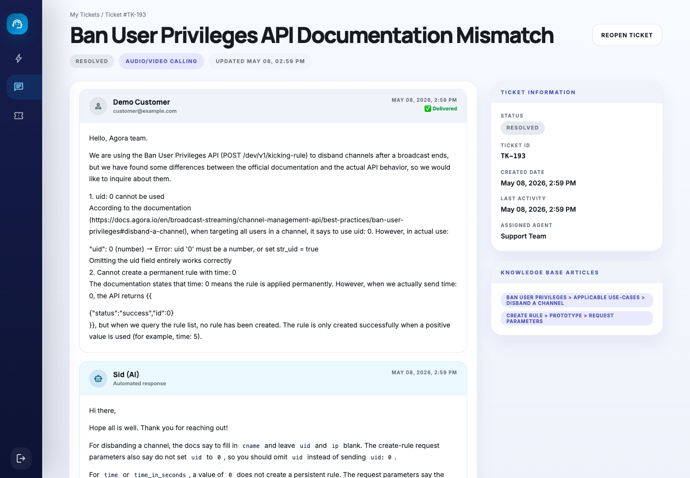
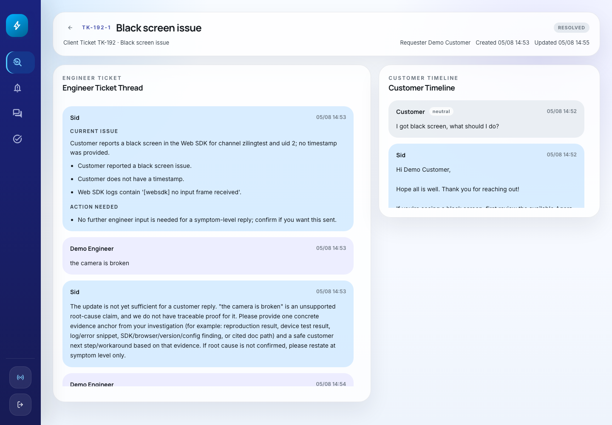
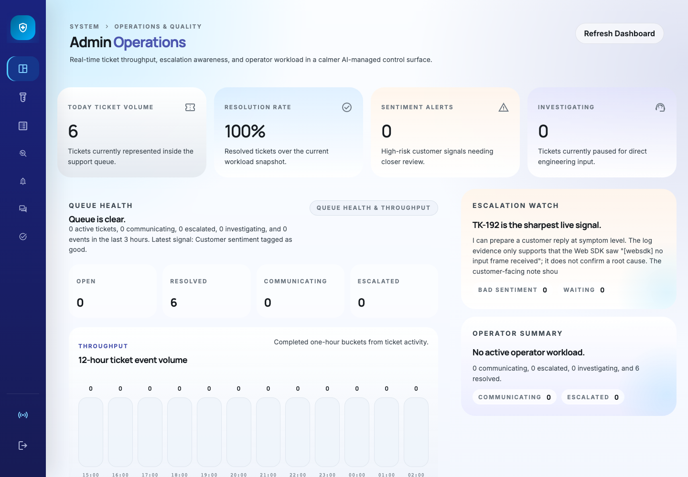
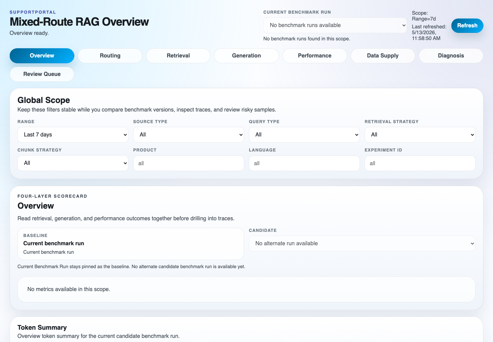

# SupportPortal

[中文](README.zh-CN.md) | [English](README.md)

SupportPortal 是一个面向技术支持场景的 AI 辅助支持平台，用于把客户提问、智能答复、工程师协同和运营可视化整合到一个完整流程中。

相比只负责记录和流转问题的传统工单系统，SupportPortal 更关注如何帮助支持团队：

1. 将每个客户问题转化为可追踪工单。
2. 在证据充分时，通过路由和 RAG 自动回答支持范围内的技术问题。
3. 在答案不确定或排查信息不足时，带着上下文升级给工程师。
4. 让工程师能够审核、协助或直接接管复杂问题。
5. 让管理和运营侧看到工单历史、运行事件、RAG 证据和 benchmark 质量。

## 当前状态

当前 POC 已经验证了端到端支持闭环：

1. 客户从 Client 页面提交问题。
2. 系统创建或更新工单。
3. Agent 对请求进行分类，在需要时检索证据并生成回复。
4. 对证据不足或需要排查的问题升级给工程师。
5. 工程师可以提供处理建议，也可以直接接管客户沟通。
6. Dashboard 展示工单状态、时间线、运行事件、RAG 证据和 benchmark 诊断。

项目已具备进入下一阶段验证的基础，后续重点是结合真实支持场景验证稳定性、运营指标和生产可用性。

## 核心能力

### Client 支持流程

- 客户提问会自动生成工单。
- 系统会区分闲聊、非 Agora 问题、Agora 非技术问题和 Agora 技术问题。
- 技术问题在证据充分时可以通过 RAG 流程自动回答。
- 排查型问题可以先补齐必要信息，再升级给工程师。
- Client 支持同一 ticket 打断重发，也允许不同 ticket 并发等待 AI 回复。
- Client 和 Engineer 共用富文本 composer，并支持安全 markdown 渲染。

### Engineer 协同

- 升级工单会进入工程师任务池。
- 工程师可以使用托管模式，只提供处理建议，由 AI 组织回复客户。
- 工程师也可以直接接管客户对话。
- 工程师调查过程按 ticket 生命周期流转，审核后的草稿可回传客户。

### Ticket Dashboard

- Dashboard 可查看全量工单、工单详情、时间线和实时事件流。
- Ticket detail 可查看按 ticket family 聚合的 token 用量摘要。
- Ticket detail 可查看 client agent runtime 摘要和最近 agent events。
- 单条 RAG 回复下可展开检索计划、执行轮次和最终证据。

### RAG Dashboard

- RAG Dashboard 可同步本地 benchmark 数据集。
- 可发起 benchmark session，并对比 run/session 诊断结果。
- 可查看 query understanding、候选漏斗、judge 分歧、token 用量和 provider/model 明细。
- 支持 live 与 benchmark case 复盘、样本评审和结果导出。

### RAG 与知识库

- 工程师可上传知识入库。
- 系统使用混合检索、重排、metadata prune 和上下文预算压缩。
- 查询扩展可使用词典、LLM 和 PRF。
- benchmark 流程提供分层诊断和失败归因。
- token 用量按 provider/model 统计，并为 future-ready usage ledger 做准备。

## 项目截图

### Client 工单流程



Client 页面展示已解决客户工单、AI 辅助回复、工单信息和知识引用，便于客户在同一个工作区内跟踪问题。

### Engineer 升级协同



Engineer 页面将工程师调查线程和客户侧时间线并排展示，便于处理需要人工判断的升级问题。

### Ticket Dashboard



Ticket Dashboard 面向管理和运营侧，展示队列健康、工作量、解决率和升级关注信号。

### RAG Workbench



RAG Workbench 支持 benchmark 复盘、基于筛选条件的诊断，以及检索和生成质量分析。

## 用户页面

本地开发默认单机栈提供以下入口：

1. Client: [http://localhost:8080/client/](http://localhost:8080/client/)
2. Engineer: [http://localhost:8080/engineer/](http://localhost:8080/engineer/)
3. Ticket Dashboard: [http://localhost:8080/dashboard/](http://localhost:8080/dashboard/)
4. RAG Workbench: [http://localhost:8080/dashboard/rag/](http://localhost:8080/dashboard/rag/)
5. Health Check: [http://localhost:8080/health](http://localhost:8080/health)

已有线上部署。如需访问入口和账号信息，请联系项目维护者。

## 本地运行

### 前置条件

1. 已安装 Podman 和 `podman-compose`。
2. 已初始化 Podman machine。

### 启动单机栈

```bash
cd /Users/xieziling/Desktop/personal_proj/SupportPortal
cp .env.example .env 2>/dev/null || true
cp .env.local.example .env.local 2>/dev/null || true

# 本地 rootless Podman 默认使用 8080。
# 确保 .env.local 中包含：NGINX_HOST_PORT=8080

podman machine start
export PODMAN_COMPOSE_PROVIDER=podman-compose

# 官方本地单机入口：
# 显式启用 .env.local 后，启动 local_lightweight + 本地 Postgres/pgvector。
bash scripts/workflow/restart_single_host_stack.sh --use-local-env

# 检查官方 deployment 栈和 build provenance。
bash scripts/workflow/inspect_single_host_stack_mode.sh
```

说明：

1. 官方本地单机栈是 `deployment`。如果看到 `deploymentlw`，先执行 `bash scripts/workflow/cleanup_single_host_aux_stack.sh`。
2. 重启脚本会把运行镜像固定到当前根 `main` 的 `app_build.ref`，避免旧 checkout 继续处理新 ticket。
3. `restart_single_host_stack.sh` 是推荐入口。不传 `--use-local-env` 时只读取 `.env`，默认是 `full + remote DB`。
4. 本地开发建议使用 `bash scripts/workflow/restart_single_host_stack.sh --use-local-env`，叠加 `.env.local` 并运行 `local_lightweight + local DB`。
5. 如果需要调试远端/RDS 数据库，使用 `bash scripts/workflow/restart_single_host_stack.sh --use-local-env --db remote`。
6. `restart_single_host_lightweight_stack.sh` 和 `restart_single_host_local_stack.sh` 仍保留为兼容 wrapper。

### 常用命令

```bash
# 查看状态
bash scripts/workflow/inspect_single_host_stack_mode.sh

# 查看服务日志
podman-compose \
  -f deployment/docker-compose.single-host.yml \
  -f deployment/docker-compose.single-host.local-lightweight.yml \
  -f deployment/docker-compose.single-host.local-db.yml \
  logs -f api rag_api rag_worker ws_gateway worker_query worker_aux nginx local_postgres

# 停止本地栈
podman-compose \
  -f deployment/docker-compose.single-host.yml \
  -f deployment/docker-compose.single-host.local-lightweight.yml \
  -f deployment/docker-compose.single-host.local-db.yml \
  down
```

## 本地修改如何生效

1. 修改了 `backend/`、`ui/client-ui/`、`ui/engineer-ui/` 或 `ui/dashboard-ui/` 后：

```bash
bash scripts/workflow/restart_single_host_stack.sh --use-local-env
bash scripts/workflow/inspect_single_host_stack_mode.sh
```

2. 只修改了 `deployment/nginx/supportportal.conf`：

```bash
podman-compose -f deployment/docker-compose.single-host.yml restart nginx
```

3. 修改了 `.env.local` 或本地 DB/RAG 配置：

```bash
bash scripts/workflow/restart_single_host_stack.sh --use-local-env
```

4. 修改了 `.env` 且仍使用 remote DB lightweight 路径：

```bash
bash scripts/workflow/restart_single_host_stack.sh --use-local-env --db remote
```

## 常见问题

1. `/health` 正常但 `localhost refused to connect`：
   - 可能访问了 `http://localhost/client` 的 80 端口。
   - 请使用 `http://localhost:8080/client/`。

2. `rootlessport cannot expose privileged port 80`：
   - rootless Podman 不能绑定 80。
   - 本地使用 `NGINX_HOST_PORT=8080`。

3. `podman compose` 调到了 `docker-compose`：
   - 执行 `export PODMAN_COMPOSE_PROVIDER=podman-compose`。

4. build 过程中出现 `pip` SSL 或 timeout 抖动：
   - 重试失败的 build 命令。
   - Dockerfile 已包含安装重试逻辑。

5. 源码已经更新，但运行行为像旧逻辑：
   - 执行 `bash scripts/workflow/inspect_single_host_stack_mode.sh`。
   - 如果脚本报告 auxiliary stack 或 build provenance mismatch，清理 `deploymentlw`，并从根 `main` 重新启动。

6. host-side ingestion 或排查脚本需要写入本地 pgvector：
   - 使用 `bash scripts/workflow/run_with_local_db_env.sh -- <command>` 包裹命令。
   - helper 会导出 `127.0.0.1:${LOCAL_POSTGRES_HOST_PORT}` 的 host DSN，容器内仍使用 `local_postgres:5432`。

## 项目目录

```text
backend/        # FastAPI 后端、worker、ws gateway、repositories、services
ui/
  client-ui/    # Client 支持页面
  engineer-ui/  # Engineer 任务和调查页面
  dashboard-ui/ # Ticket Dashboard 和 RAG Workbench
deployment/     # Compose、Nginx、systemd 和 EC2 部署资源
docs/           # 架构、产品、RAG、部署和变更日志文档
benchmarks/     # 本地 benchmark 数据集
scripts/        # 工作流、入库、benchmark 和校验脚本
```

## 关键文档

- 业务架构与三端流程：[docs/support_system_architecture.md](docs/support_system_architecture.md)
- EC2 部署指南：[docs/deploy_single_host_ec2.md](docs/deploy_single_host_ec2.md)
- 主功能清单：[docs/feature_list.md](docs/feature_list.md)
- RAG 检索链路：[docs/rag_retrieval_chain.md](docs/rag_retrieval_chain.md)
- RAG 变更日志：[docs/rag_change_log.md](docs/rag_change_log.md)
- Prompt/Model 变更日志：[docs/prompt_change_log.md](docs/prompt_change_log.md)
- UI 设计源文件：[design.md](design.md)

## 官方文档入库

仓库提供了一个手动脚本，用于发现 Agora 英文官方文档、下载 Markdown 文件，并上传到配置的知识入库端点。

```bash
python scripts/fetch_and_upload_agora_docs.py
```

本地重建时，建议显式指定本地 API：

```bash
python scripts/fetch_and_upload_agora_docs.py \
  --api-base-url http://localhost:8080 \
  --limit 3 \
  --download-workers 8
```

说明：

1. `local_knowledge/official/raw/` 每次运行都会重建。
2. 本地重建时使用 `--api-base-url http://localhost:8080`，避免误上传到远端环境。
3. 脚本会将下载和入库报告写入 `local_knowledge/official/raw/_sync_report.json`。
4. `local_knowledge/` 已加入 git ignore，应作为本地生成产物保留。

## RAG 配置摘要

默认 embedding 路径使用 SiliconFlow BGE M3 Embedding：

```env
EMBEDDING_PROVIDER=siliconflow
EMBEDDING_MODEL_ID=BAAI/bge-m3
EMBEDDING_BATCH_SIZE=16
SILICONFLOW_API_KEY=...
SILLICONFLOW_KEY=...
SILICONFLOW_BASE_URL=https://api.siliconflow.cn/v1
SILICONFLOW_EMBEDDING_DIMENSIONS=1024
PGVECTOR_TABLE=docagent_chunks_bge_m3_1024
PGVECTOR_DIM=1024
KNOWLEDGE_BM25_BACKFILL_ON_INIT=true
PRIMARY_CHUNK_STRATEGY=markdown_header_v1
SHADOW_CHUNK_STRATEGY=semantic_qwen3_v1
SHADOW_CHUNK_ENABLED=true
LOCAL_KNOWLEDGE_ROOT=local_knowledge
```

在线检索链路为：

```text
vector + true BM25 + RRF + metadata prune + rerank
```

在线只召回 `index_role='primary'` 的 chunk。Canonical 文档结构保存在 `support_knowledge_documents`；切片运行和 trace 数据保存在 `support_knowledge_chunk_runs` 和 `support_knowledge_chunk_traces`。

技术文档可以由 `n8n` 写入 `support_knowledge_source_documents`，再执行本地增量入库：

```bash
python scripts/ingest_local_knowledge_sources.py --source-system n8n --knowledge-type technical
```

## Intent Routing

客户消息进入 RAG 前会先进行路由：

1. `small_talk`：问候、天气或闲聊，按超出支持范围拒答。
2. `non_agora`：非 Agora 问题，按超出范围拒答。
3. `agora_non_technical`：Agora 相关但非技术问题，走 OpenAI Responses API web search。
4. `agora_technical`：Agora 技术问题，进入 RAG 流程。

相关环境变量：

```env
INTENT_ROUTER_MODEL=gpt-4o-mini
INTENT_ROUTER_TIMEOUT_SECONDS=3.0
INTENT_ROUTER_CONFIDENCE_THRESHOLD=0.7
OPENAI_WEB_SEARCH_MODEL=gpt-5
OPENAI_WEB_SEARCH_TIMEOUT_SECONDS=12.0
```

## Local-First Benchmark Workflow

RAG benchmark 以本地 `benchmarks/*.json` 文件作为事实来源。Dataset tables 只是这些文件在 `/dashboard/rag/` Data Supply 页面和审计流程中的镜像。

```bash
# 将本地 benchmark catalog 镜像到 dataset tables。
./.venv/bin/python scripts/sync_local_benchmarks.py

# 直接从本地 dataset 文件运行 benchmark。
./.venv/bin/python scripts/run_rag_benchmark.py \
  --dataset benchmarks/agora_rag_testset_100_mixed_en.json \
  --experiment-id agora_mixed_en_local
```

说明：

1. `scripts/run_rag_benchmark.py` 接受 `--dataset`；`--dataset-id` 和 `--suite` 已废弃。
2. `Data Supply -> Benchmark Supply -> Sync Local Benchmarks` 只将本地文件镜像到 dataset tables，不改变 benchmark 运行入口。
3. Benchmark 文件使用 NDJSON，每行一个 case，并遵循显式 route-aware contract。

## POC 缺口与下一阶段重点

当前 POC 还没有完成大规模上线所需的生产可用性工作。下一阶段建议聚焦：

1. 支持复杂会话中的文件和图片上传。
2. 支持流式答案输出。
3. 持续提升答案质量和知识命中率。
4. 验证稳定性、负载和队列积压情况。
5. 建立响应延迟、升级率、检索质量和服务健康等运营指标与告警。
