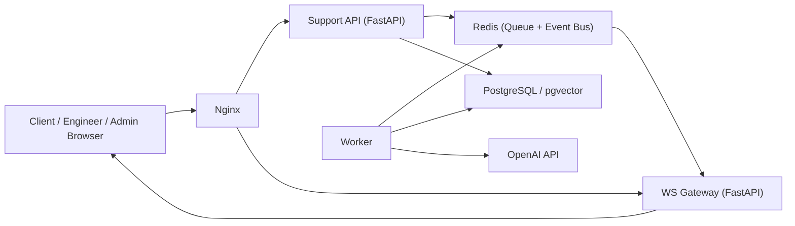

# SupportPortal 单机部署（本地 + EC2）

## 1. 架构说明（当前仓库实现）



关键点：
1. API 请求快速返回，RAG/LLM 由 Worker 异步处理。
2. WS 推送从 API 拆分到独立 `ws_gateway`。
3. 服务间事件与任务统一走 Redis。

---

## 2. 本地运行

### 2.1 前置条件
1. 安装 Podman（含 Compose 能力）。
2. 在项目根目录创建 `.env`（最少需要 OpenAI key 才能启用 RAG）。

`.env` 示例：

```bash
OPENAI_API_KEY=sk-xxxx
OPENAI_CHAT_MODEL=gpt-4.1
OPENAI_EMBEDDING_MODEL=text-embedding-3-large
RAG_TOP_K=5

# 可选：自定义 Redis/队列/事件通道
REDIS_URL=redis://redis:6379/0
TASK_QUEUE_NAME=support.tasks
EVENT_BUS_CHANNEL=support.events

# 可选：关闭异步队列模式（Compose 默认 true）
ASYNC_QUERY_ENABLED=true

# 本地 Podman rootless 建议使用 8080（避免 80 端口权限问题）
NGINX_HOST_PORT=8080
```

### 2.2 启动

```bash
podman machine start
export PODMAN_COMPOSE_PROVIDER=podman-compose
podman image rm -f localhost/supportportal-app:latest 2>/dev/null || true
podman compose -f deployment/docker-compose.single-host.yml build api
podman compose -f deployment/docker-compose.single-host.yml up -d
```

如果本机没有 `podman compose` 子命令，可用：

```bash
podman-compose -f deployment/docker-compose.single-host.yml build api
podman-compose -f deployment/docker-compose.single-host.yml up -d
```

### 2.3 验证

```bash
curl http://localhost:8080/health
curl http://localhost:8080/client
curl http://localhost:8080/engineer
curl http://localhost:8080/dashboard
```

### 2.4 常用运维命令

```bash
# 查看状态
podman compose -f deployment/docker-compose.single-host.yml ps

# 查看日志
podman compose -f deployment/docker-compose.single-host.yml logs -f api ws_gateway worker

# 停止
podman compose -f deployment/docker-compose.single-host.yml down
```

如果你使用的是 `podman-compose`，将上面命令中的 `podman compose` 替换为 `podman-compose`。

---

## 3. 部署到 AWS EC2（support.stellarix.space）

以下步骤以 Ubuntu 22.04/24.04 为例。
说明：EC2 侧继续使用 Docker（不使用 Podman）。

### 3.1 EC2 与安全组
1. 启动 1 台 EC2（建议至少 `2 vCPU / 4GB RAM`，生产建议更高）。
2. 安全组放行：
   - `22`（你的管理 IP）
   - `80`（HTTP）
   - `443`（HTTPS，后续证书启用）

### 3.2 安装 Docker

```bash
sudo apt-get update
sudo apt-get install -y ca-certificates curl gnupg
sudo install -m 0755 -d /etc/apt/keyrings
curl -fsSL https://download.docker.com/linux/ubuntu/gpg | sudo gpg --dearmor -o /etc/apt/keyrings/docker.gpg
echo \
  "deb [arch=$(dpkg --print-architecture) signed-by=/etc/apt/keyrings/docker.gpg] https://download.docker.com/linux/ubuntu \
  $(. /etc/os-release && echo $VERSION_CODENAME) stable" | \
  sudo tee /etc/apt/sources.list.d/docker.list > /dev/null
sudo apt-get update
sudo apt-get install -y docker-ce docker-ce-cli containerd.io docker-buildx-plugin docker-compose-plugin
sudo usermod -aG docker $USER
```

重新登录 SSH 后继续。

### 3.3 拉取代码并配置环境

```bash
git clone <你的仓库地址> SupportPortal
cd SupportPortal
cp .env.example .env 2>/dev/null || true
```

编辑 `.env`，至少填：
1. `OPENAI_API_KEY`
2. 如需外部数据库，填 `TICKET_DB_DSN`、`PGVECTOR_DSN`；不填则使用 Compose 内置 Postgres。
3. 将 `NGINX_HOST_PORT` 设为 `80`（EC2 用 Docker 可直接绑定 80）。

### 3.4 启动服务

```bash
docker compose -f deployment/docker-compose.single-host.yml up -d --build
docker compose -f deployment/docker-compose.single-host.yml ps
```

验证：

```bash
curl http://127.0.0.1/health
```

### 3.5 域名解析
1. 在 DNS 控制台创建 `A` 记录：
   - `support.stellarix.space -> <EC2 公网 IP>`
2. 等待解析生效后验证：

```bash
curl -I http://support.stellarix.space
```

---

## 4. HTTPS（建议）

当前 Compose 默认只开 HTTP。建议生产启用 HTTPS（可选任一方案）：

1. 方案 A：在 EC2 前挂 ALB + ACM（最省运维）。
2. 方案 B：在 EC2 直接用 Nginx + Let's Encrypt（证书自行续期）。

---

## 5. 扩容前准备（单机内）

1. 调大 API worker：
   - `API_WORKERS=2/4`（按 CPU 调整）
2. 保持异步链路开启：
   - `ASYNC_QUERY_ENABLED=true`
3. 监控重点：
   - `worker` 消费延迟
   - Redis 内存与队列长度
   - Postgres 连接数与慢查询
