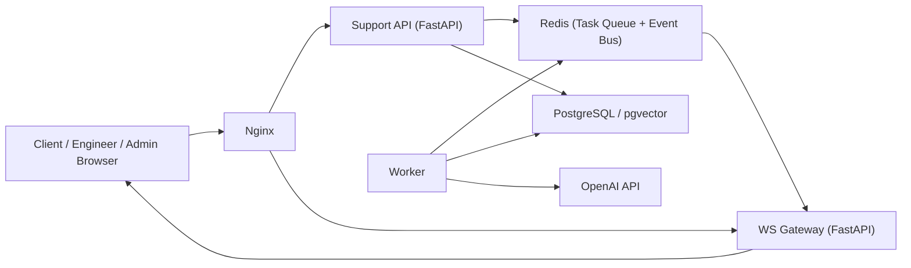

# SupportPortal 单机部署指南（本地 Podman + EC2 Docker）

## 1. 部署架构


```mermaid
flowchart LR
    Browser["Client / Engineer / Admin Browser"] --> Nginx["Nginx"]
    Nginx --> API["Support API (FastAPI)"]
    Nginx --> WSG["WS Gateway (FastAPI)"]

    API --> Redis["Redis (Task Queue + Event Bus)"]
    API --> Postgres["PostgreSQL / pgvector"]

    Worker["Worker"] --> Redis
    Worker --> Postgres
    Worker --> LLM["OpenAI API"]

    Redis --> WSG
    WSG --> Browser
```

核心说明：
1. API 快速写入工单并返回，耗时 AI 处理走 Worker 异步链路。
2. WebSocket 推送由独立 `ws_gateway` 处理，避免与 API 耦合。
3. Redis 同时承载队列与事件总线。

---

## 2. 本地部署（Podman）

### 2.1 前置条件
1. 安装 Podman。
2. 安装 `podman-compose`。
3. 首次使用 Podman Machine：

```bash
podman machine init
podman machine start
```

### 2.2 环境变量

在项目根目录创建 `.env`：

```bash
cd /Users/xieziling/Desktop/personal_proj/SupportPortal
cp .env.example .env
```

最小配置建议：

```bash
OPENAI_API_KEY=sk-xxxx
ASYNC_QUERY_ENABLED=true
NGINX_HOST_PORT=8080
```

说明：
1. 本地 rootless Podman 推荐用 `8080`，避免 80 端口权限问题。
2. 如果未配置 `OPENAI_API_KEY`，RAG/LLM 能力会降级。

### 2.3 启动

```bash
cd /Users/xieziling/Desktop/personal_proj/SupportPortal
export PODMAN_COMPOSE_PROVIDER=podman-compose

podman-compose -f deployment/docker-compose.single-host.yml build api
podman-compose -f deployment/docker-compose.single-host.yml up -d
```

### 2.4 访问
1. 客户端: [http://localhost:8080/client/](http://localhost:8080/client/)
2. 工程师端: [http://localhost:8080/engineer/](http://localhost:8080/engineer/)
3. 管理端: [http://localhost:8080/dashboard/](http://localhost:8080/dashboard/)
4. 健康检查: [http://localhost:8080/health](http://localhost:8080/health)

### 2.5 运维命令

```bash
# 查看服务状态
podman-compose -f deployment/docker-compose.single-host.yml ps

# 查看日志
podman-compose -f deployment/docker-compose.single-host.yml logs -f api ws_gateway worker nginx

# 停止服务
podman-compose -f deployment/docker-compose.single-host.yml down
```

### 2.6 常见问题

1. 报错 `rootlessport cannot expose privileged port 80`：
   - 原因：rootless Podman 不能绑 80。
   - 处理：`.env` 中设置 `NGINX_HOST_PORT=8080`。

2. 报错 `Dockerfile not found in .../deployment/backend/Dockerfile`：
   - 原因：compose 相对路径基准错误。
   - 处理：使用当前仓库内最新 `deployment/docker-compose.single-host.yml`。

3. `podman compose` 实际调用了 docker-compose：
   - 处理：`export PODMAN_COMPOSE_PROVIDER=podman-compose`。

4. 浏览器 `ERR_CONNECTION_REFUSED`：
   - 先检查 `podman-compose ... ps`。
   - 使用带端口 URL，比如 `http://localhost:8080/client/`。

---

## 3. EC2 部署（Docker）

说明：EC2 上使用 Docker，不使用 Podman。

### 3.1 准备 EC2
1. Ubuntu 22.04/24.04。
2. 安全组开放：
   - `22`（管理 IP）
   - `80`（HTTP）
   - `443`（HTTPS）

### 3.2 安装 Docker

```bash
sudo apt-get update
sudo apt-get install -y ca-certificates curl gnupg
sudo install -m 0755 -d /etc/apt/keyrings
curl -fsSL https://download.docker.com/linux/ubuntu/gpg | sudo gpg --dearmor -o /etc/apt/keyrings/docker.gpg
echo \
  "deb [arch=$(dpkg --print-architecture) signed-by=/etc/apt/keyrings/docker.gpg] https://download.docker.com/linux/ubuntu \
  $(. /etc/os-release && echo $VERSION_CODENAME) stable" | \
  sudo tee /etc/apt/sources.list.d/docker.list > /dev/null
sudo apt-get update
sudo apt-get install -y docker-ce docker-ce-cli containerd.io docker-buildx-plugin docker-compose-plugin
sudo usermod -aG docker $USER
```

重新登录后继续。

### 3.3 拉取代码与环境配置

```bash
git clone <你的仓库地址> SupportPortal
cd SupportPortal
cp .env.example .env
```

`.env` 至少配置：
1. `OPENAI_API_KEY`
2. `NGINX_HOST_PORT=80`
3. AWS Postgres：`TICKET_DB_DSN`、`PGVECTOR_DSN`
4. `TICKET_DB_SCHEMA=supportportal`
5. `PGVECTOR_SCHEMA=supportportal`
6. `PGVECTOR_TABLE=docagent_chunks`

如果工单库和向量库共用同一个 AWS Postgres，部署脚本会在缺少 `TICKET_DB_DSN` 时自动复用 `PGVECTOR_DSN`；但生产环境仍建议两个字段都明确写入 `.env`。

### 3.4 启动服务

```bash
docker compose -f deployment/docker-compose.single-host.yml up -d --build
docker compose -f deployment/docker-compose.single-host.yml ps
```

验证：

```bash
curl http://127.0.0.1/health
```

### 3.5 域名接入
1. 在 DNS 配置 `A` 记录：
   - `support.stellarix.space -> <EC2 公网 IP>`
2. 验证：

```bash
curl -I http://support.stellarix.space
```

---

## 4. 更新发布流程

### 4.1 本地 Podman

```bash
cd /Users/xieziling/Desktop/personal_proj/SupportPortal
podman-compose -f deployment/docker-compose.single-host.yml build api
podman-compose -f deployment/docker-compose.single-host.yml up -d api ws_gateway worker
```

### 4.2 EC2 Docker

```bash
cd ~/SupportPortal
git pull
docker compose -f deployment/docker-compose.single-host.yml build api
docker compose -f deployment/docker-compose.single-host.yml up -d api ws_gateway worker nginx
```

### 4.3 EC2 一键部署脚本（推荐）

仓库内已提供脚本：

```bash
cd ~/SupportPortal
chmod +x deployment/deploy_ec2.sh
./deployment/deploy_ec2.sh
```

脚本会执行：
1. 拉取最新代码（`git fetch/pull`，默认当前分支）。
2. 重启容器（`docker compose down` + `up -d --build`）。
3. 健康检查（`http://127.0.0.1:<NGINX_HOST_PORT>/health`）。
4. 外网检查（默认 `https://support.stellarix.space/health`）。

常用参数：

```bash
# 指定分支
./deployment/deploy_ec2.sh --branch main

# 指定域名
./deployment/deploy_ec2.sh --domain support.stellarix.space

# 只重启，不拉代码
./deployment/deploy_ec2.sh --skip-pull

# 部署后跟随日志
./deployment/deploy_ec2.sh --logs
```

---

## 5. HTTPS 建议

生产建议二选一：
1. EC2 前挂 ALB + ACM（推荐，证书托管）。
2. EC2 本机 Nginx + Let's Encrypt。
