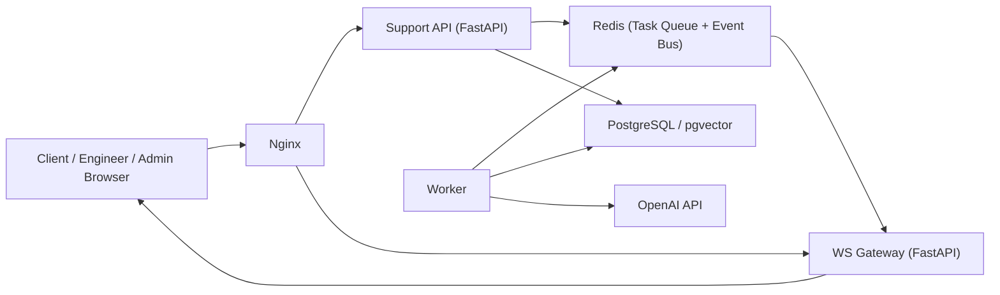

# SupportPortal 单机部署指南（本地 Podman + EC2 Docker）

## 1. 部署架构


```mermaid
flowchart LR
    Browser["Client / Engineer / Admin Browser"] --> Nginx["Nginx"]
    Nginx --> API["Support API (FastAPI)"]
    Nginx --> WSG["WS Gateway (FastAPI)"]

    API --> Redis["Redis (Task Queue + Event Bus)"]
    API --> Postgres["PostgreSQL / pgvector"]

    Worker["Worker"] --> Redis
    Worker --> Postgres
    Worker --> LLM["OpenAI API"]

    Redis --> WSG
    WSG --> Browser
```

核心说明：
1. API 快速写入工单并返回，耗时 AI 处理走 Worker 异步链路。
2. WebSocket 推送由独立 `ws_gateway` 处理，避免与 API 耦合。
3. Redis 同时承载队列与事件总线。

---

## 2. 本地部署（Podman）

### 2.1 前置条件
1. 安装 Podman。
2. 安装 `podman-compose`。
3. 首次使用 Podman Machine：

```bash
podman machine init
podman machine start
```

### 2.2 环境变量

在项目根目录创建 `.env`：

```bash
cd /Users/xieziling/Desktop/personal_proj/SupportPortal
cp .env.example .env
```

最小配置建议：

```bash
OPENAI_API_KEY=sk-xxxx
ASYNC_QUERY_ENABLED=true
NGINX_HOST_PORT=8080
```

说明：
1. 本地 rootless Podman 推荐用 `8080`，避免 80 端口权限问题。
2. 如果未配置 `OPENAI_API_KEY`，RAG/LLM 能力会降级。

### 2.3 启动

```bash
cd /Users/xieziling/Desktop/personal_proj/SupportPortal
cp .env.example .env 2>/dev/null || true
export PODMAN_COMPOSE_PROVIDER=podman-compose

bash scripts/workflow/restart_single_host_stack.sh --mode local_lightweight --db remote
```

说明：
1. 官方推荐入口统一为 `bash scripts/workflow/restart_single_host_stack.sh`。本地开发使用 `--mode local_lightweight --db remote`；生产 / EC2 / 需要本地 ML 依赖的验证继续使用默认 full 模式。
2. 所有单机重建脚本都只能从根工作区的干净 `main` 运行；如果本地 `main` 没有同步到 `origin/main`，脚本会直接失败。
3. 官方本地单机栈只有 `deployment`；重建前脚本会先清理 stray/unsupported 的 `deploymentlw`，避免并存运行。
4. 重建脚本会导出当前根 `main` 对应的 `APP_RUNTIME_IMAGE=localhost/supportportal-app:<app_build.ref>`；不要再从任意 task worktree 直接执行 `podman-compose ... up -d --build`，否则运行中的 API/worker 可能和根 `main` 不一致。
5. 根 `.env` 是应用唯一运行配置源。脚本先执行 compose 校验和镜像构建，再停止旧栈；build 失败不会中断旧栈，新栈启动或健康检查失败时会恢复上一 API 镜像并返回非零。

### 2.3.1 本地 lightweight 重建（线上/RDS DB）

```bash
cd /Users/xieziling/Desktop/personal_proj/SupportPortal
cp .env.example .env 2>/dev/null || true
export PODMAN_COMPOSE_PROVIDER=podman-compose

bash scripts/workflow/restart_single_host_stack.sh --mode local_lightweight --db remote
```

说明：
1. 该模式只用于本地开发，不改变 EC2 / `support.stellarix.space` 的 full build 默认行为。
2. lightweight override 会把本地 `api` 的镜像构建切到 `INSTALL_ML_DEPS=0`，同时将本地 sentiment provider 固定为 `legacy`。
3. 这会跳过 `torch` / `sentence-transformers` / `accelerate` 的镜像安装，缩短本地 build 与重启过程。
4. 默认 `EMBEDDING_PROVIDER=siliconflow` 仍可正常工作；如果你把 `EMBEDDING_PROVIDER` 改成 `local_bge_m3`，`/health.config_warnings` 会报告该 lightweight 镜像不兼容。
5. 轻量模式的 `/health.runtime_profile` 固定为 `local_lightweight`；full 模式固定为 `full`。
6. `--mode local_lightweight --db remote` 只读取根 `.env`，并继续使用其中的线上/RDS `TICKET_DB_DSN` / `PGVECTOR_DSN`。
7. 如果 `.env` 使用 `hostaddr=192.168.127.254` 和 `:15433`，脚本会继续调用 `ensure_local_db_relay.sh`。
8. `restart_single_host_lightweight_stack.sh` 仍保留可用，但只是兼容 wrapper，不再作为主推荐入口。

### 2.3.2 显式使用本地 Postgres/pgvector

```bash
cd /Users/xieziling/Desktop/personal_proj/SupportPortal
export PODMAN_COMPOSE_PROVIDER=podman-compose

bash scripts/workflow/restart_single_host_stack.sh --mode local_lightweight --db local
```

说明：
1. 该路径保留给需要临时使用本地空库调试 ticket/event/RAG pgvector 存储的场景。
2. 脚本会额外启动 `pgvector/pgvector:pg16`，并把容器内 `TICKET_DB_DSN` / `PGVECTOR_DSN` 指向 `local_postgres:5432`。
3. 本地库首次启动为空库，现有 repository 初始化会自动创建 ticket/event/RAG 表；不会复制线上数据，也不会写 demo seed。
4. 如需让 host-side ingestion 脚本写入本地 RAG 库，使用 `bash scripts/workflow/run_with_local_db_env.sh -- <command>`。
5. `restart_single_host_local_stack.sh` 仍保留可用，但只是显式 local DB 的兼容 wrapper。

### 2.4 访问
1. 客户端: [http://localhost:8080/client/](http://localhost:8080/client/)
2. 工程师端: [http://localhost:8080/engineer/](http://localhost:8080/engineer/)
3. 管理端: [http://localhost:8080/dashboard/](http://localhost:8080/dashboard/)
4. 健康检查: [http://localhost:8080/health](http://localhost:8080/health)

补充：
1. `/health` 现在会返回 `app_build.ref` 和 `app_build.built_at`，可直接核对当前在线 API / RAG 服务到底跑的是哪次构建。
2. `/health.runtime_profile` 会直接告诉你当前官方单机栈跑的是 `full` 还是 `local_lightweight`。
3. `bash scripts/workflow/inspect_single_host_stack_mode.sh` 会同时校验根 `main` ref、容器镜像 tag、`/health.app_build.ref` 三者一致；任何不一致都应视为环境不可信。
4. 在 local lightweight 模式下，如果你错误地把 `SENTIMENT_PROVIDER=model` 或 `EMBEDDING_PROVIDER=local_bge_m3` 打开，`/health.config_warnings` 会给出兼容性提示。

### 2.5 运维命令

```bash
# local lightweight + 线上/RDS DB（官方本地默认）
bash scripts/workflow/restart_single_host_stack.sh --mode local_lightweight --db remote

# local lightweight + 本地 Postgres/pgvector
bash scripts/workflow/restart_single_host_stack.sh --mode local_lightweight --db local

# 让 host-side 命令使用本地 DB/RAG DSN
bash scripts/workflow/run_with_local_db_env.sh -- python scripts/ingest_local_knowledge_sources.py --source-system n8n --knowledge-type technical

# 检查并补起本机 DB relay（在当前 .env 明确依赖 relay 时）
bash scripts/workflow/ensure_local_db_relay.sh

# 检查当前官方单机栈模式，并校验 build provenance
bash scripts/workflow/inspect_single_host_stack_mode.sh

# 清理 stray/unsupported 的 deploymentlw
bash scripts/workflow/cleanup_single_host_aux_stack.sh

# 查看服务状态
podman-compose \
  -f deployment/docker-compose.single-host.yml \
  -f deployment/docker-compose.single-host.local-lightweight.yml \
  ps

# 查看日志
podman-compose \
  -f deployment/docker-compose.single-host.yml \
  -f deployment/docker-compose.single-host.local-lightweight.yml \
  logs -f api rag_api rag_worker ws_gateway worker_query worker_aux nginx

# 停止服务
podman-compose \
  -f deployment/docker-compose.single-host.yml \
  -f deployment/docker-compose.single-host.local-lightweight.yml \
  down
```

### 2.6 常见问题

1. 报错 `rootlessport cannot expose privileged port 80`：
   - 原因：rootless Podman 不能绑 80。
   - 处理：在根 `.env` 中为本地 lightweight 设置 `NGINX_HOST_PORT=8080`；full / EC2 可使用其部署所需端口。

2. 报错 `Dockerfile not found in .../deployment/backend/Dockerfile`：
   - 原因：compose 相对路径基准错误。
   - 处理：使用当前仓库内最新 `deployment/docker-compose.single-host.yml`。

3. `podman compose` 实际调用了 docker-compose：
   - 处理：`export PODMAN_COMPOSE_PROVIDER=podman-compose`。

4. 浏览器 `ERR_CONNECTION_REFUSED`：
   - 先检查 `podman-compose ... ps`。
   - 使用带端口 URL，比如 `http://localhost:8080/client/`。

5. `/health` 变成 `ticket_storage=memory`，engineer 端看不到 ticket：
   - 默认本地 lightweight 路径走线上/RDS DB，先运行 `bash scripts/workflow/ensure_local_db_relay.sh`，再运行 `bash scripts/workflow/restart_single_host_stack.sh --mode local_lightweight --db remote`。
   - 如果明确使用本地 Postgres 路径，运行 `bash scripts/workflow/restart_single_host_stack.sh --mode local_lightweight --db local` 并确认 `local_postgres` 健康。
   - relay 路径的完整排障步骤见 [local_db_relay_recovery.md](./local_db_relay_recovery.md)。

---

## 3. EC2 部署（Docker）

说明：EC2 上使用 Docker，不使用 Podman。

现有线上环境从多 env 文件迁移到单一根 `.env` 时，请先执行
[线上单一 `.env` 迁移报告](./production_env_migration_report.md)中的三阶段 gate 和人工 image-ID rollback 流程。不要直接删除线上旧 env 文件。

### 3.1 准备 EC2
1. Ubuntu 22.04/24.04。
2. 安全组开放：
   - `22`（管理 IP）
   - `80`（HTTP）
   - `443`（HTTPS）

### 3.2 安装 Docker

```bash
sudo apt-get update
sudo apt-get install -y ca-certificates curl gnupg
sudo install -m 0755 -d /etc/apt/keyrings
curl -fsSL https://download.docker.com/linux/ubuntu/gpg | sudo gpg --dearmor -o /etc/apt/keyrings/docker.gpg
echo \
  "deb [arch=$(dpkg --print-architecture) signed-by=/etc/apt/keyrings/docker.gpg] https://download.docker.com/linux/ubuntu \
  $(. /etc/os-release && echo $VERSION_CODENAME) stable" | \
  sudo tee /etc/apt/sources.list.d/docker.list > /dev/null
sudo apt-get update
sudo apt-get install -y docker-ce docker-ce-cli containerd.io docker-buildx-plugin docker-compose-plugin
sudo usermod -aG docker $USER
```

重新登录后继续。

### 3.3 拉取代码与环境配置

```bash
git clone <你的仓库地址> SupportPortal
cd SupportPortal
cp .env.example .env
```

`.env` 至少配置：
1. `OPENAI_API_KEY`
2. `NGINX_HOST_PORT=80`
3. AWS Postgres：`TICKET_DB_DSN`、`PGVECTOR_DSN`
4. `TICKET_DB_SCHEMA=supportportal`
5. `PGVECTOR_SCHEMA=supportportal`
6. `PGVECTOR_TABLE=docagent_chunks_qwen3_1024`
7. `PGVECTOR_DIM=1024`

如果工单库和向量库共用同一个 AWS Postgres，部署脚本会在缺少 `TICKET_DB_DSN` 时自动复用 `PGVECTOR_DSN`；但生产环境仍建议两个字段都明确写入 `.env`。

### 3.4 启动服务

```bash
docker compose -f deployment/docker-compose.single-host.yml up -d --build
docker compose -f deployment/docker-compose.single-host.yml ps
```

验证：

```bash
curl http://127.0.0.1/health
```

### 3.5 域名接入
1. 在 DNS 配置 `A` 记录：
   - `support.stellarix.space -> <EC2 公网 IP>`
2. 验证：

```bash
curl -I http://support.stellarix.space
```

---

## 4. 更新发布流程

### 4.1 本地 Podman

```bash
cd /Users/xieziling/Desktop/personal_proj/SupportPortal
bash scripts/workflow/restart_single_host_stack.sh --mode local_lightweight --db remote
```

本地如果明确需要 full 模式，可改用：

```bash
cd /Users/xieziling/Desktop/personal_proj/SupportPortal
bash scripts/workflow/restart_single_host_stack.sh
```

### 4.2 EC2 Docker

```bash
cd ~/SupportPortal
git pull
docker compose -f deployment/docker-compose.single-host.yml build api
docker compose -f deployment/docker-compose.single-host.yml up -d api ws_gateway worker nginx
```

### 4.3 EC2 一键部署脚本（推荐）

仓库内已提供脚本：

```bash
cd ~/SupportPortal
chmod +x deployment/deploy_ec2.sh
./deployment/deploy_ec2.sh
```

脚本会执行：
1. 拉取最新代码（`git fetch/pull`，默认当前分支）。
2. 在 build 前检查镜像存储所在磁盘的剩余空间，默认要求至少 `40 GiB`。
3. 如果剩余空间低于阈值，会自动执行 `docker builder prune -af` 和 `docker image prune -af` 后再复查。
4. 如果清理后仍低于阈值，会直接失败并输出明确错误，不会开始 `docker compose build`。
5. 先执行 `docker compose build`，只有构建成功后才会继续切换服务。
6. 重启容器（`docker compose down` + `up -d`）。
7. 健康检查（`http://127.0.0.1:<NGINX_HOST_PORT>/health`）。
8. 外网检查（默认 `https://support.stellarix.space/health`）。
9. 使用仓库根目录下的 `.deploy_ec2.lock` 避免并发部署。

这样即使镜像构建阶段失败，也不会先把线上容器停掉。

磁盘预检查支持两个可选环境变量：
1. `DEPLOY_MIN_FREE_DISK_GB`
   - 默认 `40`
   - 设为 `0` 可关闭预检查
2. `DEPLOY_DISK_CHECK_PATH`
   - 默认自动优先检查 `/var/lib/containerd`，其次 `/var/lib/docker`，最后 `/`
   - 你也可以手动指定实际的镜像存储路径

常用参数：

```bash
# 指定分支
./deployment/deploy_ec2.sh --branch main

# 指定域名
./deployment/deploy_ec2.sh --domain support.stellarix.space

# 只重启，不拉代码
./deployment/deploy_ec2.sh --skip-pull

# 部署后跟随日志
./deployment/deploy_ec2.sh --logs
```

---

### 4.4 EC2 每日自动部署 + 失败邮件告警

仓库已提供以下资产：
1. 自动调度 wrapper：`scripts/ops/auto_deploy_ec2.sh`
2. 日报/AI 分析 helper：`scripts/ops/build_auto_deploy_report.py`
3. 一键 bootstrap 脚本：`scripts/ops/bootstrap_auto_deploy_ec2.sh`
4. systemd service：`deployment/systemd/supportportal-auto-deploy.service`
5. systemd timer：`deployment/systemd/supportportal-auto-deploy.timer`
6. 环境变量模板：`deployment/systemd/auto-deploy.env.example`

自动调度 wrapper 会执行：
1. 获取 `origin` 最新 refs。
2. 比较本地 `HEAD` 和 `origin/main`。
3. 如果远端有新提交，调用 `deployment/deploy_ec2.sh --branch main --domain support.stellarix.space` 做完整部署。
4. 如果没有新提交，只做内外网健康检查，不重启容器。
5. 无论成功还是失败，都会尝试调用 Amazon SES 发一封日报。
6. 日报会附带 `docker compose ps` 摘要、最近 docker 日志摘录，以及可选的 AI 日志分析。

#### 4.4.1 前置条件

1. EC2 上的部署仓库保持在干净的 `main`。
2. EC2 已绑定允许发 SES 邮件的 IAM role。
3. `DEPLOY_ALERT_FROM` 已在 SES 对应 region 完成验证。
4. SES 账号已退出 sandbox；如果还没退出，收件邮箱也必须先验证。
5. 机器可访问互联网下载 AWS CLI 安装包。
6. 如果你希望日报包含 AI 日志分析，仓库 `.env` 中需要有可用的 `OPENAI_API_KEY`。

建议的最小 IAM policy：

```json
{
  "Version": "2012-10-17",
  "Statement": [
    {
      "Effect": "Allow",
      "Action": [
        "ses:SendEmail"
      ],
      "Resource": "*"
    }
  ]
}
```

#### 4.4.2 推荐：一键 bootstrap

先在仓库 `.env` 中填写这些键：

```env
DEPLOY_DOMAIN=support.stellarix.space
DEPLOY_AWS_REGION=us-east-1
DEPLOY_ALERT_FROM=alerts@example.com
DEPLOY_ALERT_TO=alerts@example.com
DEPLOY_REPORT_ENABLE_AI=true
DEPLOY_REPORT_MODEL=gpt-5.4-mini
DEPLOY_REPORT_REASONING_EFFORT=low
DEPLOY_REPORT_LOG_SINCE=24h
DEPLOY_REPORT_LOG_LINES_PER_SERVICE=120
DEPLOY_REPORT_MAX_LOG_CHARS=12000
DEPLOY_REPORT_TIMEZONE=Asia/Shanghai
DEPLOY_MIN_FREE_DISK_GB=40
DEPLOY_DISK_CHECK_PATH=
```

如果你已经习惯旧命名，bootstrap 脚本也兼容：
1. `AWS_REGION`
2. `ALERT_FROM_EMAIL`
3. `ALERT_TO_EMAIL`

如果启用 AI 日志分析，还需要在同一个仓库 `.env` 中保留：

```env
OPENAI_API_KEY=<your-openai-key>
```

`OPENAI_API_KEY` 继续只放在仓库 `.env` 中；它不会被复制到 `/etc/supportportal/auto-deploy.env`。

然后直接运行：

```bash
cd ~/SupportPortal
git fetch origin
git switch main
git pull --ff-only origin main
chmod +x scripts/ops/bootstrap_auto_deploy_ec2.sh
./scripts/ops/bootstrap_auto_deploy_ec2.sh
```

bootstrap 脚本会尽可能自动完成：
1. 安装 AWS CLI。
2. 校验 EC2 IAM role 是否可用。
3. 为 `DEPLOY_ALERT_FROM` / `DEPLOY_ALERT_TO` 创建 SES email identity。
4. 从仓库 `.env` 生成 `/etc/supportportal/auto-deploy.env`。
5. 安装并启用 `supportportal-auto-deploy.timer`。

如果脚本提示 `AWS credentials unavailable`，先给实例绑定 IAM role，再重新运行一次。

#### 4.4.3 手动安装配置

先准备 `/etc/supportportal/auto-deploy.env`：

```bash
sudo install -d -m 0755 /etc/supportportal
sudo cp deployment/systemd/auto-deploy.env.example /etc/supportportal/auto-deploy.env
sudo nano /etc/supportportal/auto-deploy.env
```

至少填写：
1. `DEPLOY_BRANCH=main`
2. `DEPLOY_DOMAIN=support.stellarix.space`
3. `DEPLOY_ALERT_TO=<你的收件邮箱>`
4. `DEPLOY_ALERT_FROM=<SES 已验证发件地址>`
5. `DEPLOY_AWS_REGION=<SES 所在 region>`

可选覆盖：
1. `DEPLOY_REPORT_ENABLE_AI=true`
2. `DEPLOY_REPORT_MODEL=gpt-5.4-mini`
3. `DEPLOY_REPORT_REASONING_EFFORT=low`
4. `DEPLOY_REPORT_LOG_SINCE=24h`
5. `DEPLOY_REPORT_LOG_LINES_PER_SERVICE=120`
6. `DEPLOY_REPORT_MAX_LOG_CHARS=12000`
7. `DEPLOY_REPORT_TIMEZONE=Asia/Shanghai`
8. `DEPLOY_MIN_FREE_DISK_GB=40`
9. `DEPLOY_DISK_CHECK_PATH=/var/lib/containerd`

安装 systemd unit。下面的命令会把默认仓库路径 `/opt/supportportal/SupportPortal` 和默认用户 `ubuntu` 替换成当前机器的真实值：

```bash
sudo sed \
  -e "s#/opt/supportportal/SupportPortal#${HOME}/SupportPortal#g" \
  -e "s#User=ubuntu#User=${USER}#g" \
  deployment/systemd/supportportal-auto-deploy.service \
  | sudo tee /etc/systemd/system/supportportal-auto-deploy.service >/dev/null

sudo cp deployment/systemd/supportportal-auto-deploy.timer /etc/systemd/system/supportportal-auto-deploy.timer
sudo systemctl daemon-reload
sudo systemctl enable --now supportportal-auto-deploy.timer
```

默认 timer 使用：

```ini
OnCalendar=*-*-* 19:00:00 UTC
```

这等价于每天北京时间 03:00。如果你的 EC2 已经把系统时区切到 `Asia/Shanghai`，也可以把 timer 改成：

```ini
OnCalendar=*-*-* 03:00:00 Asia/Shanghai
```

#### 4.4.4 手动触发与状态检查

```bash
# 立刻执行一次
sudo systemctl start supportportal-auto-deploy.service

# 看最近一次运行状态
sudo systemctl status supportportal-auto-deploy.service

# 看下一次触发时间
systemctl list-timers supportportal-auto-deploy.timer

# 看日志
journalctl -u supportportal-auto-deploy.service -n 200 --no-pager
```

每次运行都会尝试发一封日报：
1. 成功标题：`SupportPortal Report 4/4`
2. 失败标题：`[Failed] SupportPortal Report 4/4`

日报正文固定包含：
1. 运行摘要
2. 健康检查结果
3. `docker compose ps` 服务状态
4. AI 日志分析
5. 可疑原始日志 / 回退诊断

#### 4.4.5 故障排查

1. 如果 service 直接失败，先看：

```bash
journalctl -u supportportal-auto-deploy.service -n 200 --no-pager
```

2. 如果日志提示 `Deploy checkout must be clean`：
   - 说明部署仓库有未提交或未清理的改动，先恢复到干净 `main`。

3. 如果日志提示 `Another deployment or auto health check is already running`：
   - 说明有手动部署或另一轮自动任务正在执行。
   - 两个脚本共享 `.deploy_ec2.lock`，等上一轮完成后再重试。

4. 如果部署成功但没有收到邮件：
   - 检查 `DEPLOY_ALERT_FROM` 是否已在对应 region 验证。
   - 检查 EC2 IAM role 是否有 `ses:SendEmail` 权限。
   - 检查 SES 是否仍处于 sandbox。
   - 检查 `journalctl -u supportportal-auto-deploy.service` 里是否出现 `Daily report sent via SES`。

5. 如果 systemd 没有按时触发：
   - 用 `systemctl list-timers supportportal-auto-deploy.timer` 检查下次触发时间。
   - 确认 `Persistent=true` 已生效；实例关机错过时间窗后，开机应自动补跑一次。

6. 如果日报收到了，但 AI 区块显示 unavailable：
   - 先检查仓库 `.env` 中是否存在 `OPENAI_API_KEY`。
   - 检查 `DEPLOY_REPORT_ENABLE_AI` 是否被设为 `false`。
   - 如果 OpenAI 调用失败，日报仍会照常发送，但 AI 区块会回退成 unavailable 文本，不会阻塞部署或健康检查。

7. 如果部署前直接失败，日志里出现 `below required ... GiB even after docker cache cleanup`：
   - 说明脚本已经自动清理了 builder/image 缓存，但剩余空间仍低于阈值。
   - 先执行 `df -h`、`docker system df` 确认磁盘使用情况。
   - 可以扩容 EBS，或手动再次执行 `docker builder prune -af` / `docker image prune -af` 后重试。
   - 如果确实需要调整阈值，再修改 `DEPLOY_MIN_FREE_DISK_GB`，不要直接关闭预检查。

---

## 5. HTTPS 建议

生产建议二选一：
1. EC2 前挂 ALB + ACM（推荐，证书托管）。
2. EC2 本机 Nginx + Let's Encrypt。
