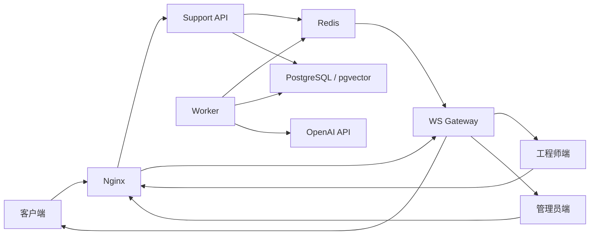
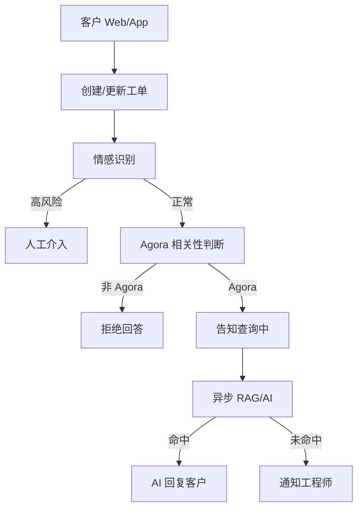
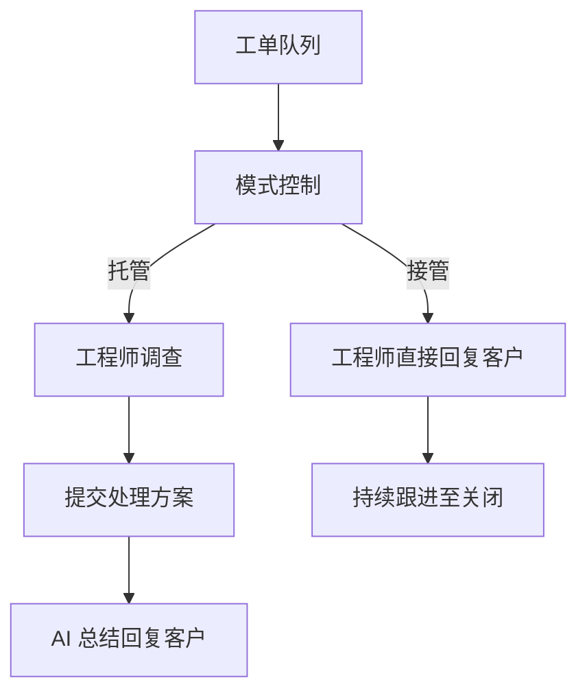
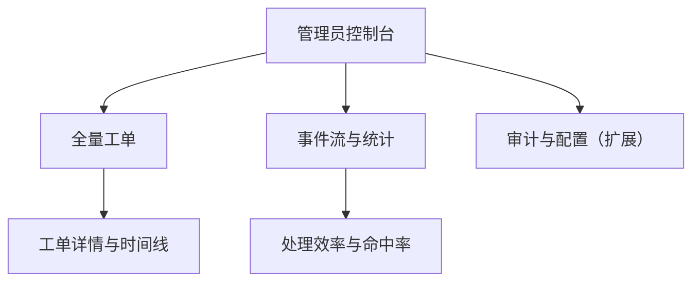
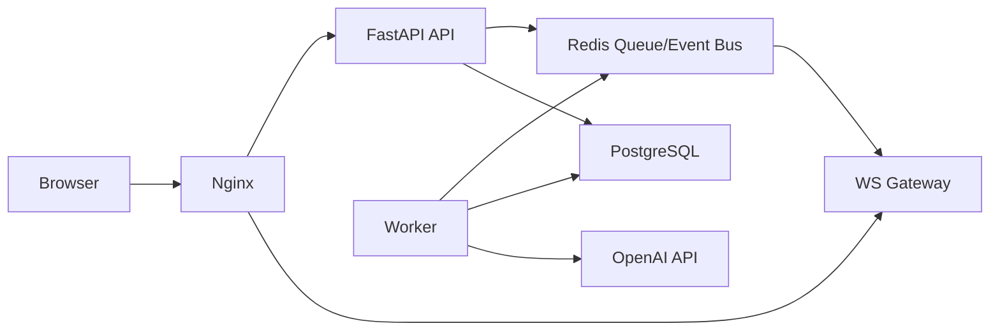
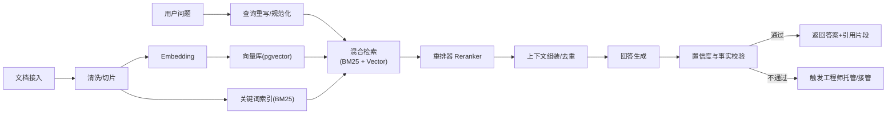

# SupportPortal POC 报告（V1）

## 1. 摘要
- 项目名称：SupportPortal
- 报告日期：2026-03-08
- 作者/团队：SupportPortal 项目组
- POC 结论：部分通过

简述：
- 本次 POC 目标是验证技术支持系统在单机部署下的端到端可行性，包括客户端、工程师端、管理员端三端协同。
- 系统已完成 `Nginx + API + WS Gateway + Worker + Redis + PostgreSQL` 的可运行架构，并完成本地 Podman 启动与健康检查。
- 业务链路已覆盖工单创建、情感分流、RAG 异步处理、工程师托管/接管模式、管理员追踪。
- 当前性能压测与线上级监控尚未完成，建议进入下一阶段进行稳定性和容量验证。

## 2. 背景与问题定义
- 当前业务痛点：客服问题处理依赖人工，响应速度和处理一致性不足；复杂问题缺少 AI+人工协同机制。
- 目标用户：客户端（提问）、工程师端（处理）、管理员端（追踪与审计）。
- 需要验证的关键假设：
  1. 单机架构可以稳定支撑三端协同和实时通知。
  2. AI 与工程师可以在同一工单内完成托管/接管协同闭环。
  3. RAG 未命中和高情绪场景可自动触发人工介入。

## 3. POC 目标与范围
### 3.1 目标
1. 验证工单闭环：客户提问 -> AI/RAG -> 工程师介入 -> 关闭工单。
2. 验证三端协作可用性与实时性。
3. 验证单机部署可运行并可演进到高并发架构。

### 3.2 范围内
- 单机运行编排：`Nginx + API + WS Gateway + Worker + Redis + PostgreSQL`
- 三端页面：`/client/`、`/engineer/`、`/dashboard/`
- 异步任务链路与实时事件推送

### 3.3 范围外
- 多节点容灾与自动弹性扩缩容
- 全量压测与生产级 SLA 验证
- 完整运营后台能力（高级权限、策略中心、报表体系）

## 4. 整体架构图与功能点

### 4.1 整体架构图

### 4.2 核心功能点
1. 工单化：客户每次提问都落为工单，支持追踪与审计。
2. 智能分流：情绪识别 + 领域判断（Agora 相关性）控制流转路径。
3. AI 问答：RAG 命中自动回复，未命中触发人工介入。
4. 人工协同：工程师托管/接管两种模式，支持随时切换。
5. 实时可见：通过 WS 推送同步工单状态与关键事件。
6. 运维可落地：本地 Podman 与 EC2 Docker 部署路径统一。

## 5. 三端视角：功能与架构

### 5.1 客户端

功能要点：
1. 提交问题并创建/更新工单。
2. 接收 AI 回复与工单状态变化。
3. 在人工接管场景下接收工程师直接回复。

客户端架构图：

### 5.2 工程师端

功能要点：
1. 接收待处理工单与升级通知。
2. 支持托管/接管模式切换。
3. 托管模式下给 AI 方案；接管模式下直接回复客户。

工程师端架构图：

### 5.3 管理员端

功能要点：
1. 查看全量工单、状态与时间线。
2. 跟踪事件流与处理效率。
3. 为后续规则配置、审计、指标体系提供入口。

管理员端架构图：

## 6. 运维视角项目架构

### 6.1 运维架构图

### 6.2 运维说明
1. Nginx 作为统一入口，拆分 API 与 WebSocket 流量。
2. API 负责同步写入与快速返回，避免长耗时阻塞。
3. Worker 消费 Redis 队列处理 RAG/AI 任务。
4. WS Gateway 从 Redis 事件总线消费并推送到三端。
5. PostgreSQL 持久化工单、消息、事件，支持回溯。

## 7. 面向高并发的优化/改动计划

### 7.1 已完成的并发友好改造
1. 从“同步问答”改为“API 快速返回 + Worker 异步处理”。
2. 从“API 内聚 WS 推送”改为独立 `ws_gateway`。
3. 引入 Redis 作为任务队列与事件总线。

### 7.2 下一步优化清单
| 优化项 | 当前状态 | 计划改动 | 预期收益 |
|---|---|---|---|
| API 横向扩展 | 单机多进程 | 拆多实例 + 统一入口负载 | 提升吞吐、降低排队 |
| Worker 并发 | 单 worker | 多 worker + 队列监控 | 降低任务积压 |
| 数据库连接 | 直连 | 引入连接池/PgBouncer | 降低连接抖动 |
| 热点读取 | 直查 DB | 增加 Redis 缓存层 | 降低 DB 压力 |
| 可观测性 | 基础日志 | 指标+Trace+告警 | 快速定位性能瓶颈 |
| 限流熔断 | 未完善 | API 限流/超时/重试策略 | 防止雪崩与级联故障 |

### 7.3 建议演进路线
1. 第 1 阶段：补齐监控告警与压测基线。
2. 第 2 阶段：提升 Worker 并发与 DB 连接治理。
3. 第 3 阶段：API/WS 多实例化，验证高并发稳定性。

### 7.4 RAG 系统后续优化计划

目标：
1. 提升知识召回与答案准确率，降低“未命中转人工”比例。
2. 在并发上升时保持低延迟与可预测成本。
3. 提高可解释性（返回依据）与安全性（降低幻觉和误答）。

RAG 优化架构（未来）：

核心改造项：
| 改造项 | 当前状态 | 计划改动 | 预期收益 |
|---|---|---|---|
| 检索策略 | 单路检索 | 升级为 BM25+向量混合检索 | 提升召回率，减少漏检 |
| 结果排序 | 基础相似度 | 增加 Cross-Encoder Reranker | 提升 Top-K 命中质量 |
| 上下文构建 | 简单拼接 | 分块去重、来源优先级、token 预算 | 降低噪声与成本 |
| 答案可靠性 | 仅 LLM 输出 | 增加置信度门控与拒答策略 | 降低幻觉与误答 |
| 数据新鲜度 | 手动更新 | 增量索引 + 定时重建 | 提升时效性 |
| 观测能力 | 基础日志 | 增加检索/生成链路指标和追踪 | 快速定位命中率下降原因 |

建议指标（下一阶段）：
1. Retrieval Recall@5 >= 90%
2. RAG 命中后首答准确率 >= 85%
3. RAG 查询链路 P95 延迟 <= 1.5s
4. “未命中转人工”比例环比下降 >= 20%
5. 引用覆盖率（答案含可追溯片段）>= 95%

分阶段推进：
1. Phase 1（1-2 周）：补齐评测集、离线评测脚本、基础监控。
2. Phase 2（2-3 周）：上线混合检索 + 重排，做 A/B 对比。
3. Phase 3（2-4 周）：上线置信度门控、拒答与人工协同策略。
4. Phase 4（持续）：按领域扩展知识库与自动化回归评测。

## 8. 实施与部署
### 8.1 本地环境（Podman）
- 部署方式：`podman-compose -f deployment/docker-compose.single-host.yml`
- 运行状态：6 个容器均已启动（`nginx/api/ws_gateway/worker/redis/postgres`）
- 健康检查：`/health` 返回 `status=ok`，`ticket_storage=postgres`，`async_query_enabled=true`

### 8.2 EC2 环境（Docker）
- 目标部署：单台 EC2
- 域名规划：`support.stellarix.space`
- 部署方式：`docker compose -f deployment/docker-compose.single-host.yml`

## 9. 验证设计
### 9.1 测试场景
1. 普通问题（RAG 命中）
2. RAG 未命中（工程师介入）
3. 高情绪问题（直接人工介入）
4. 工程师托管与接管切换
5. 管理端追踪工单状态与事件

### 9.2 验收指标（当前状态）
| 指标 | 目标 | 当前结果 | 结论 |
|---|---:|---:|---|
| 服务健康检查 | 200/OK | 已通过 | 通过 |
| 三端可访问性 | 100% | 已通过（本地 8080） | 通过 |
| 告警推送延迟 | <= 30s | 待专项测试 | 待验证 |
| RAG 命中准确率 | >= 85% | 待专项测试 | 待验证 |
| API 延迟（P95） | 待定义 | 待专项测试 | 待验证 |

## 10. 结果与发现
### 10.1 已验证能力
1. 单机下三端 + API + 实时推送 + 异步处理链路已打通。
2. 工单可持久化到 PostgreSQL，支持事件追踪。
3. 本地 Podman 与 EC2 Docker 双部署路径已明确。

### 10.2 问题与限制
1. 构建阶段存在偶发网络抖动（`pip` SSL/timeout）风险。
2. 本地 rootless Podman 不能直接绑定 80 端口（需 8080）。
3. 性能与容量仍缺少系统化压测数据支撑。

## 11. 风险评估
| 风险 | 影响 | 可能性 | 缓解措施 |
|---|---|---|---|
| 外部依赖网络抖动导致构建失败 | 中 | 中 | Dockerfile 增加 pip 重试；失败重建 |
| 高并发下队列积压导致响应延迟 | 高 | 中 | 增加监控与告警，提升 worker 并发，做限流 |
| 数据库连接压力过高 | 高 | 中 | 引入连接池/PgBouncer，优化查询与索引 |

## 12. 结论
- POC 是否达到目标：达到核心目标（架构与业务链路可运行）
- 建议是否进入下一阶段：建议进入
- 决策说明：功能可行性已被验证，下一阶段应聚焦稳定性、性能与运维标准化。

## 13. 下一步计划（2-4 周）
1. 完成关键路径压测（API、WS、Worker、DB）。
2. 增加监控告警（队列长度、推送延迟、慢查询、容器健康）。
3. 完成 EC2 首次部署与域名联调（`support.stellarix.space`）。
4. 输出上线前检查清单（回滚、备份、证书、发布流程）。

## 附录
- 架构文档：`docs/support_system_architecture.md`
- 部署文档：`docs/deploy_single_host_ec2.md`
- 进度追踪：`docs/poc_progress.md`
- 计划文档：`docs/poc_plan.md`
- POC 模板：`docs/poc_report_template.md`
