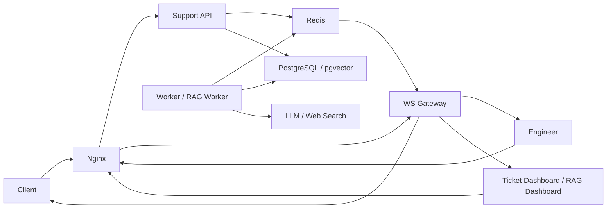

# SupportPortal POC 报告（V2）

> 快照日期：2026-04-05
> 历史快照：`docs/poc_report_v1.md`（2026-03-08）

## 1. 摘要与决策

- 当前结论：**POC 部分通过，建议进入下一阶段；暂不建议直接生产上线。**
- 本次已验证：客户入口分流、Agentic RAG 技术答复、证据不足升级工程师、工程师调查闭环、Ticket Dashboard / RAG Dashboard 可观测与复盘、单机与 EC2 发布链路。
- 当前仍缺：系统级性能压测、稳定性基线、运行态监控告警体系、附件上传、流式输出。

截至 2026-04-05，SupportPortal 已经不只是“本地能跑通的 demo”。仓库事实表明，系统已经具备从客户提问、产品化分流、Agentic technical support、证据不足转人工、工程师审核回传，到 Dashboard / RAG Workbench 观察与复盘的核心闭环。POC 的基础可行性已经成立，下一阶段应转向容量、可观测性和交付稳定性，而不是继续证明系统能否工作。

这份报告不把旧的 P1-P5 阶段闸门作为正文主线。阶段计划和过程记录仍保留在 `docs/poc_plan.md`、`docs/poc_progress.md` 中，本文只基于截至 2026-04-05 的仓库事实做结果汇报，不补写未验证数字，也不把缺口包装成“已完成”。

## 2. 背景与验证目标

SupportPortal 要验证的不是单点 AI 能力，而是一条完整的 support ticket 闭环是否成立：客户能否被正确分流，技术问题能否先走受控的 AI/RAG 路径，证据不足时能否稳定转工程师处理，处理过程能否被 Dashboard 追踪，系统又能否以单机架构稳定部署和持续迭代。

本次结果汇报重点回答四个问题：

1. 客户入口是否已经具备 product-aware 的分流和问题整形能力。
2. 技术问题是否已经具备 route-to-skill、post-RAG sufficiency gate 和证据不足升级机制。
3. 工程师端是否已经形成正式的调查 ticket 生命周期，而不是临时人工兜底。
4. Dashboard、benchmark 和部署链路是否已经支撑下一阶段继续优化，而不只是一次性演示。

本次 POC 仍然不覆盖这些目标：多节点高可用、正式生产 SLO、完整附件类工单处理、流式交互体验、长期稳定性和容量上限证明。

## 3. 已验证能力

| 已验证能力 | 证据来源 | 当前结论 | 业务意义 |
|---|---|---|---|
| 客户入口与产品化分流 | `README.md` 的 `Intent Routing`、`docs/feature_list.md`、`docs/rag_change_log.md` 中 2026-04-01 的 routing entries、`docs/prompt_change_log.md` 中 2026-04-01/2026-04-02 的 prompt/model entries | 客户入口已能先做产品选择、范围识别、troubleshooting intake，并把请求稳定分配到 `refuse / web_search / rag` | 先把问题送到正确处理链路，减少越界问答、错误升级和无效模型成本 |
| Agentic RAG 与证据不足升级 | `docs/rag_change_log.md` 中 2026-03-31、2026-04-01、2026-04-02、2026-04-03 的 sufficiency / query-understanding / hardening entries，`docs/prompt_change_log.md` 中对应 prompt records | 技术问题已不是“直接检索后回答”，而是 route-to-skill、query-understanding、RAG answer、sufficiency judge、失败后 investigate 的受控链路 | AI 可以先回答能回答的技术问题，同时把证据不足场景稳定交给人工，而不是硬答 |
| 工程师 ticket 生命周期与协同 | `docs/feature_list.md` 的 Engineer 端已完成项、`docs/rag_change_log.md` 中 2026-04-01 的 engineer ticket lifecycle entry、`docs/support_system_architecture.md` | `investigating` 状态已经被正式收敛成工程师侧工作流，工程师可以托管/接管、审核草稿并回传客户 | 人工介入不再是链路外动作，而是系统内可追踪、可审核的正式环节 |
| Ticket Dashboard / RAG Dashboard 的可观测与复盘 | `docs/feature_list.md` 的 Ticket Dashboard / RAG Dashboard、`README.md` 的 Local-First Benchmark Workflow、`docs/rag_change_log.md` 中 2026-03-22 / 2026-03-23 的 dataset factory、scorecard、diagnosis entries | Dashboard 已不只是展示页面，而是具备 ticket timeline、agent runtime 摘要、benchmark、diagnosis、review 的复盘闭环 | 团队可以观察真实工单与 benchmark 结果，并用统一界面定位 route / retrieval / answer 的问题边界 |
| 单机部署、EC2 发布与交付链路 | `README.md`、`docs/deploy_single_host_ec2.md`、`deployment/deploy_ec2.sh`、`deployment/systemd/supportportal-auto-deploy.service`、`deployment/systemd/supportportal-auto-deploy.timer`、相关提交 `ec610c6` / `e127beb` / `9fb15a6` | 系统已具备本地 Podman、EC2 Docker、部署锁、失败不先停服、定时自动部署和失败告警的基础交付能力 | 下一阶段可以在真实环境持续迭代，而不是每次靠人工拼装部署 |

总结来看，POC 的核心价值已经从“证明能做”推进到“证明闭环成立并可继续工程化”。当前最重要的变化，是 support flow 已经形成明确边界：能自动处理的走 AI，证据不足的进工程师 ticket，所有关键环节都能被记录和复盘。

## 4. 方案与架构

业务闭环已经收敛为一条清晰路径：客户先进入 product-aware 入口，系统根据范围和问题类型做 `refuse / web_search / rag` 分流；Agora technical 问题进入 Agentic RAG，先做 retrieval planning 和 grounded answer，再由 sufficiency judge 决定是直接答复还是升级工程师；一旦进入 `investigating`，系统会创建正式的工程师调查工作流，由工程师托管或接管处理并回传客户；Ticket Dashboard 负责追踪工单与 runtime，RAG Dashboard 负责 benchmark、diagnosis 和 review。

部署层面，当前 POC 采用单机可运行架构：`Nginx + API + WS Gateway + Worker + Redis + PostgreSQL`。这个架构已经同时覆盖本地 Podman 和 EC2 Docker 两条路径，足够支撑下一阶段做容量、稳定性和运维治理，而不需要先重写整体部署模型。

## 5. 验证证据

本报告只引用仓库内已经存在的验证记录，不补造新的实测数字。证据主要来自三类来源：

1. 功能事实来源：
   - `README.md` 给出了当前单机架构、三端入口、Intent Routing、benchmark workflow 和部署命令。
   - `docs/feature_list.md` 给出了截至当前的主功能完成面，以及仍未完成的上传附件、流式输出等缺口。
   - `docs/support_system_architecture.md` 给出了三端协同和人工介入的系统边界。

2. 变更与回归验证来源：
   - `docs/rag_change_log.md` 记录了 2026-03-31 的 post-RAG sufficiency gate、2026-04-01 的 client route-to-skill hard cutover 与 engineer lifecycle、2026-04-02 的 query-understanding、2026-04-03 的 latency / failure-path hardening。
   - 这些记录包含针对性 test suite、全量 backend regression、compose 重启、`/health` 检查、以及 live API smoke 的结果。例如 2026-04-01 的 client routing entry 记录了 `339 passed` 与 live route smoke，2026-04-01 的 engineer lifecycle entry 记录了 `345 passed` 与 investigate lifecycle smoke，2026-04-02 的 query-understanding entry 记录了 `375 passed` 与 live health / runtime probes。
   - `docs/prompt_change_log.md` 记录了 2026-04-01 至 2026-04-03 间与 routing、web search、RAG answer、sufficiency judge、query-understanding、reasoning latency 直接相关的 prompt/model 演进，证明 support flow 的核心决策面已经被显式建模和审计。

3. 评测与交付链路来源：
   - `docs/rag_change_log.md` 中 2026-03-22 和 2026-03-23 的 entries 证明 RAG Workbench 已具备 dataset factory、snapshot benchmark、scorecard、diagnosis 和 review queue，而不是仅能看单次结果。
   - `docs/deploy_single_host_ec2.md`、`deployment/deploy_ec2.sh`、systemd timer/service 和相关提交说明 EC2 交付已做过失败不先停服、锁保护、定时任务和告警能力的加固。
   - 这意味着下一阶段具备继续做真实环境验证的工程基础，而不是每次手工部署后再临时排障。

从证据形态看，当前仓库对“功能正确性”和“闭环完整性”的证明已经较强；对“性能上限”“长期稳定性”和“生产运行质量”的证明仍然偏弱，这也是本报告给出“建议进入下一阶段，但不建议直接上线”的原因。

## 6. 风险与缺口

| 未验证项/风险 | 当前影响 | 是否阻塞下一阶段 | 建议动作 |
|---|---|---|---|
| 系统级性能压测与容量基线缺失 | 还无法对 API、Worker、WS、Postgres 在真实负载下的承载上限做可靠判断 | 否 | 建立标准压测场景、SLA 指标和容量模型，补齐 P95/P99、队列延迟、连接数和错误率基线 |
| 长时间稳定性与故障演练不足 | 当前更像功能性验证，尚不足以证明长时间运行、重启恢复、依赖抖动下的系统韧性 | 否 | 增加 soak test、重启恢复演练、依赖降级验证和回滚演练 |
| 运行态监控与告警体系仍不完整 | 已有 auto-deploy 与失败告警基础，但队列积压、WS 连接、慢查询、RAG 失败率还缺统一观察面 | 否 | 建立 dashboard + alert 基线，覆盖队列长度、重试次数、超时、依赖健康和发布失败 |
| 附件上传未完成 | 客户和工程师仍不能直接围绕图片、日志、文本附件协作，复杂排障场景的信息采集能力不足 | 否 | 先定义支持的文件类型、大小限制、存储方式和安全策略，再补上传链路 |
| 流式输出未完成 | 客户端和工程师端的交互反馈仍偏“整包返回”，体验上不够即时 | 否 | 先补统一 streaming contract，再决定 UI 呈现和中断策略 |
| 生产级发布准入标准未固化 | 团队容易把“POC 已成立”误解成“可以直接上线” | 否 | 为下一阶段补一套明确的 go-live gate，包括性能、观测、回滚、值班和数据健康检查 |

这些风险不会否定当前 POC 已成立的事实，但它们足以说明：当前系统适合继续验证和小范围演进，不适合直接作为 production-ready 结论对外承诺。

## 7. 下一阶段建议

下一阶段建议聚焦四件事：

1. 把“能跑通”升级为“可度量”。
   - 为 API、RAG、Worker、WebSocket、数据库建立统一的性能与容量基线。
2. 把“有日志”升级为“可观测”。
   - 补齐运行态 dashboard、报警策略、慢查询和队列健康检查。
3. 把“闭环成立”升级为“体验完整”。
   - 优先补附件上传和流式输出，覆盖真实 support 场景中的高频体验缺口。
4. 把“可部署”升级为“可持续交付”。
   - 在已有 EC2 deploy hardening 的基础上，补 runbook、回滚流程、发布准入和小范围试运行标准。

建议的下一阶段目标，不是继续证明 SupportPortal 是否可行，而是把已经成立的 support loop 做成一个可度量、可观测、可持续发布的小规模试运行系统。达到这一点之后，再讨论 production pilot 会更稳妥。
