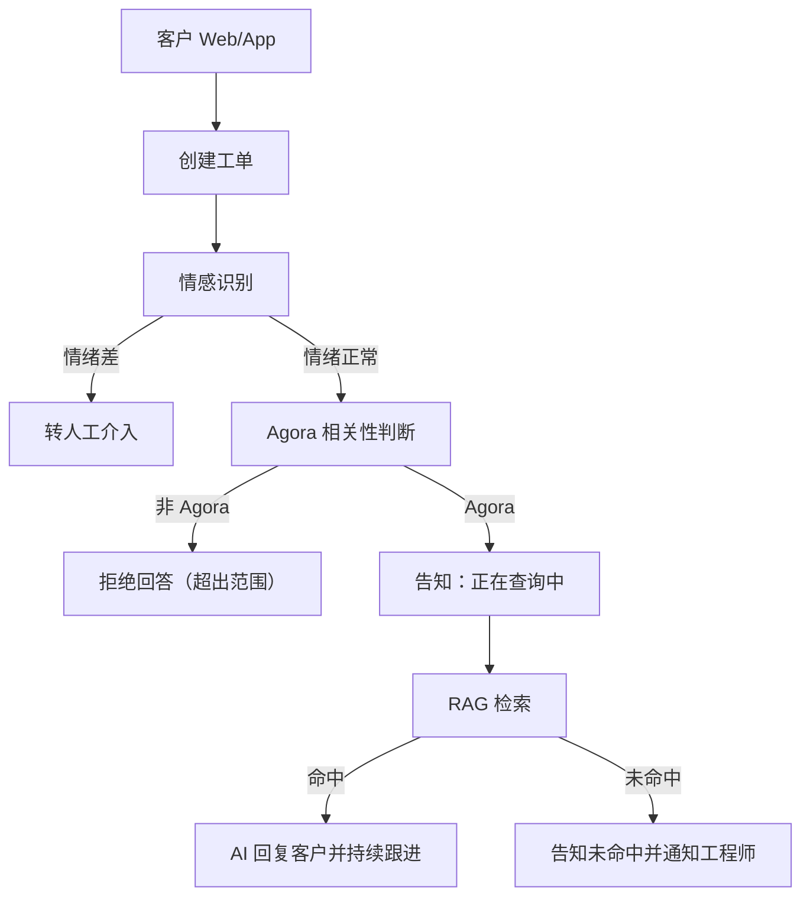
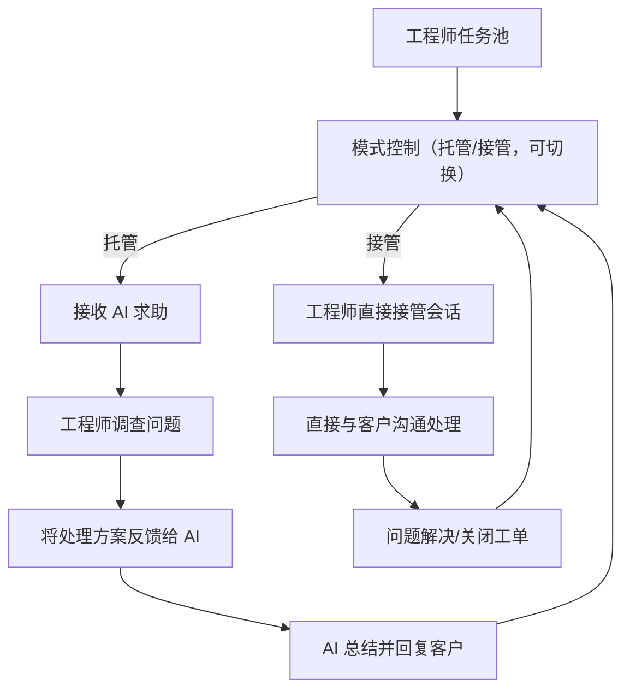
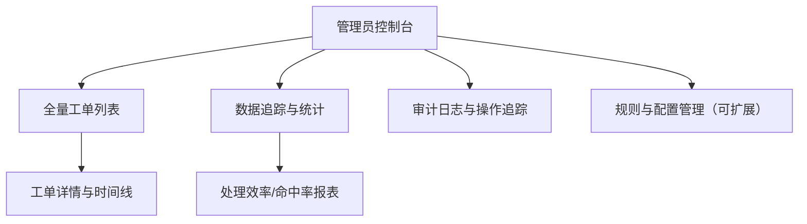
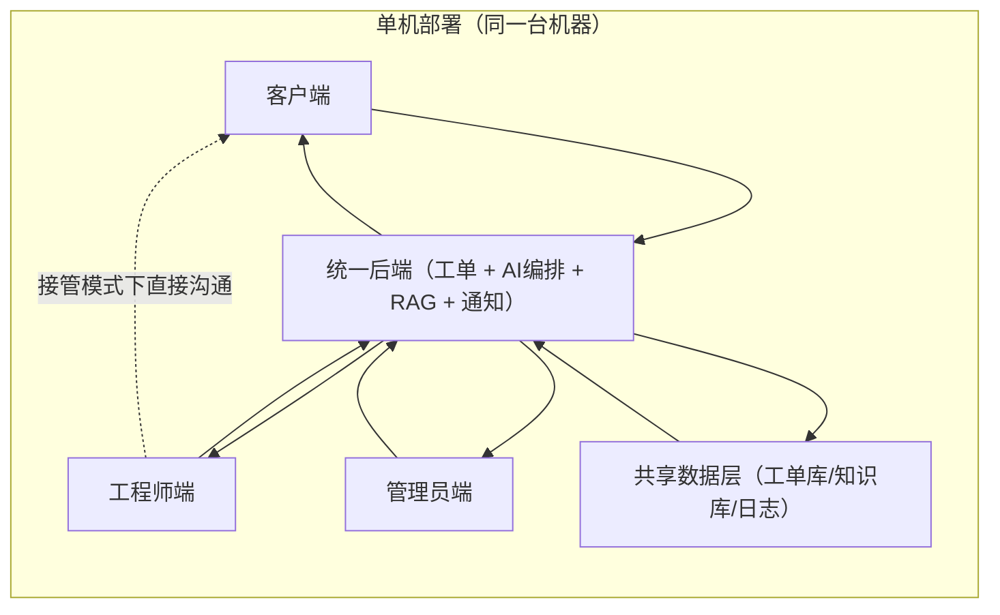

# 技术支持系统架构说明

## 1. 文档目标
本文件用于统一说明技术支持系统的整体架构，以及客户端、工程师端、管理员端三端架构。

## 2. 系统边界与部署假设
1. 系统包含三端：客户端、工程师端、管理员端。
2. 三端与后端服务部署在同一台机器上（单机部署）。
3. 客户问题以“工单”为最小处理单位（每个问题对应一个工单）。

## 3. 客户端架构

客户端侧关键规则：
1. 先做情感识别，再做领域判断。
2. 触发工程师介入有两类情况：`情绪差` 或 `RAG 未命中`。

## 4. 工程师端架构

工程师端关键规则：
1. `托管模式`：工程师给方案，AI 负责组织答案并持续跟进客户。
2. `接管模式`：工程师直接与客户沟通，AI 不参与对话。
3. 工程师可随时在两种模式之间切换。

## 5. 管理员端架构

管理员端当前定位：
1. 可见性：查看所有工单细节和处理过程。
2. 可追踪性：跟踪工单流转、处理质量、数据变化。
3. 可扩展性：后续逐步补齐规则配置、策略管理、运营分析能力。

## 6. 总体交互架构（3 端协同）

交互说明：
1. 客户端仅通过统一后端提交问题、接收回复与工单状态。
2. 后端负责情感识别、Agora 判断、RAG 检索、模式分发与通知。
3. 工程师端在托管模式通过后端协作，在接管模式可直接对接客户。
4. 管理员端通过后端查看全局工单与追踪数据，不直接参与客户对话。

## 7. 核心处理闭环
1. 客户提交问题并生成工单。
2. 后端先做情感识别，再做 Agora 领域判断。
3. Agora 问题进入 RAG 检索；命中则 AI 回复，未命中则升级工程师。
4. 工程师选择托管或接管处理，直到问题解决并关闭工单。
5. 管理员端全程可追踪工单与数据变化。
