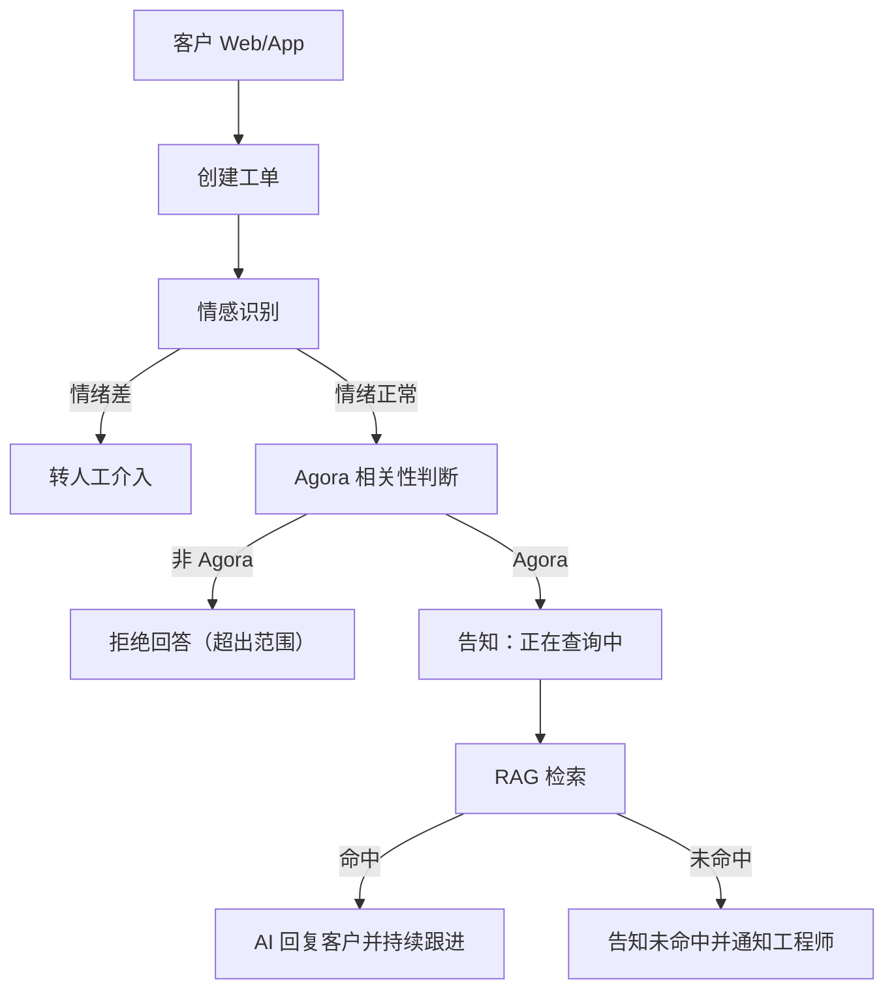
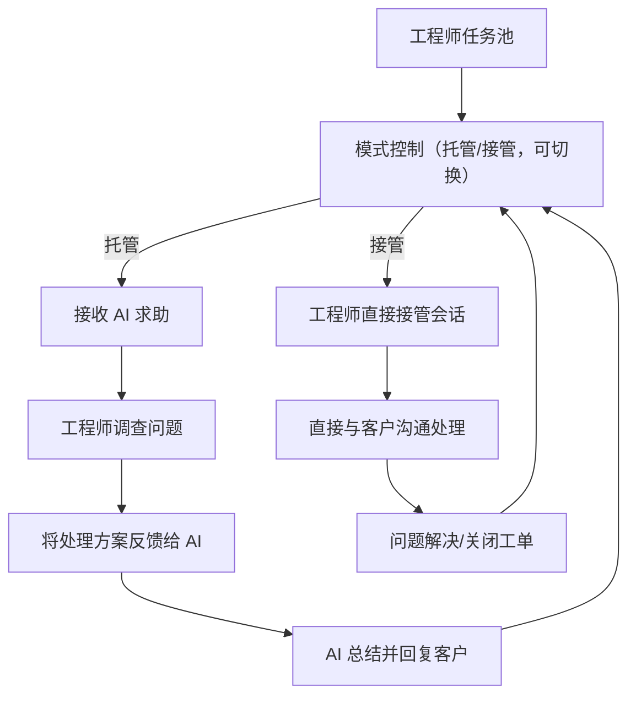
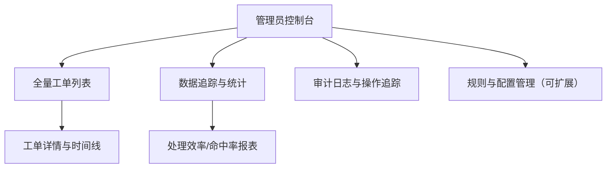
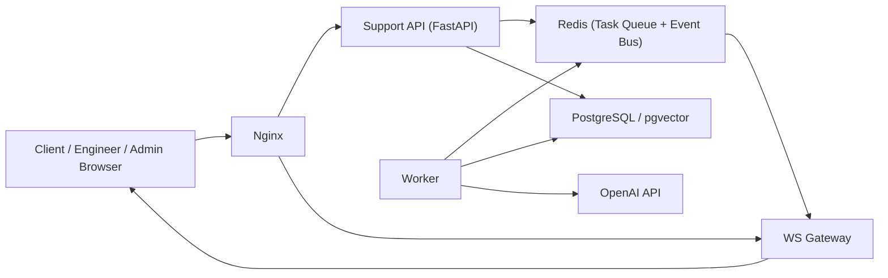
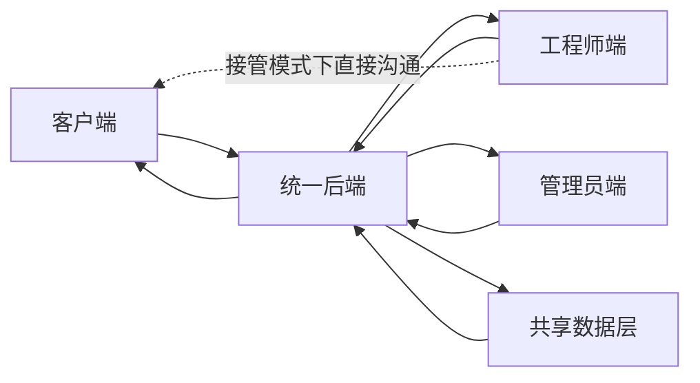

# 技术支持系统架构说明

## 1. 文档目标
本文件用于说明：
1. 三端业务架构（客户端、工程师端、管理员端）。
2. 单机运维部署架构（Nginx/API/WS/Worker/Redis/Postgres）。
3. 从工单提交到处理闭环的核心链路。

## 2. 系统边界
1. 每个客户问题都创建为一个工单。
2. 三端共享同一后端与数据层。
3. 工程师可在 `托管` 与 `接管` 两种模式间切换。

---

## 3. 客户端业务架构

```mermaid
flowchart TB
    U["客户 Web/App"] --> T["创建工单"]
    T --> S["情感识别"]

    S -- 情绪差 --> H["转人工介入"]
    S -- 情绪正常 --> R["Agora 相关性判断"]

    R -- 非 Agora --> X["拒绝回答（超出范围）"]
    R -- Agora --> W["告知：正在查询中"]
    W --> G["RAG 检索"]

    G -- 命中 --> A["AI 回复客户并持续跟进"]
    G -- 未命中 --> N["告知未命中并通知工程师"]
```

客户端规则：
1. 先做情感识别，再做领域判断。
2. 需要工程师介入的触发条件：`情绪差` 或 `RAG 未命中`。

---

## 4. 工程师端业务架构

```mermaid
flowchart TB
    Q["工程师任务池"] --> M["模式控制（托管/接管，可切换）"]

    M -- 托管 --> P1["接收 AI 求助"]
    P1 --> P2["工程师调查问题"]
    P2 --> P3["将处理方案反馈给 AI"]
    P3 --> P4["AI 总结并回复客户"]

    M -- 接管 --> K1["工程师直接接管会话"]
    K1 --> K2["直接与客户沟通处理"]
    K2 --> K3["问题解决/关闭工单"]

    P4 --> M
    K3 --> M
```

工程师规则：
1. 托管模式：工程师给方案，AI 负责组织与持续跟进。
2. 接管模式：工程师直接沟通，AI 不参与回复。
3. 模式可随时切换。

---

## 5. 管理员端业务架构

```mermaid
flowchart TB
    A0["管理员控制台"] --> A1["全量工单列表"]
    A1 --> A2["工单详情与时间线"]
    A0 --> A3["数据追踪与统计"]
    A3 --> A4["处理效率/命中率报表"]
    A0 --> A5["审计日志与操作追踪"]
    A0 --> A6["规则与配置管理（可扩展）"]
```

管理员定位：
1. 可见性：查看工单全链路细节。
2. 可追踪性：监控处理质量与效率。
3. 可扩展性：规则、配置、策略后续扩展。

---

## 6. 单机运维部署架构（当前实现）

```mermaid
flowchart LR
    Browser["Client / Engineer / Admin Browser"] --> Nginx["Nginx"]

    Nginx --> API["Support API (FastAPI)"]
    Nginx --> WSG["WS Gateway"]

    API --> Redis["Redis (Task Queue + Event Bus)"]
    API --> Postgres["PostgreSQL / pgvector"]

    Worker["Worker"] --> Redis
    Worker --> Postgres
    Worker --> LLM["OpenAI API"]

    Redis --> WSG
    WSG --> Browser
```

部署特性：
1. API 快速返回，耗时 AI 查询由 Worker 异步消费。
2. WS Gateway 独立处理长连接和事件推送。
3. Redis 统一承载任务队列与事件总线。

---

## 7. 三端总体交互

```mermaid
flowchart LR
    C["客户端"] --> B["统一后端"]
    B --> C

    B --> E["工程师端"]
    E --> B
    E -. 接管模式下直接沟通 .-> C

    A["管理员端"] --> B
    B --> A

    B --> D["共享数据层"]
    D --> B
```

交互说明：
1. 客户端通过后端提交问题、接收状态与回复。
2. 后端将人工介入任务分发给工程师端。
3. 管理员端通过后端观察全局，不直接参与对话。

---

## 8. 核心处理闭环
1. 客户提交消息并生成/更新工单。
2. 后端执行情感识别与领域判断。
3. 可自动处理的请求进入 AI/RAG 流程。
4. 未命中或高风险工单升级给工程师。
5. 工程师托管或接管处理，直至工单关闭。
6. 管理员端全程追踪处理状态与数据指标。
