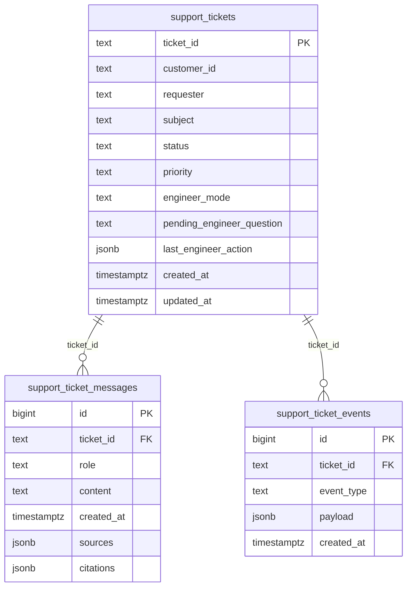

# 工单数据库架构图（PostgreSQL）

## 索引
- `support_tickets(status, updated_at DESC)`
- `support_tickets(priority, updated_at DESC)`
- `support_ticket_messages(ticket_id, created_at ASC, id ASC)`
- `support_ticket_events(ticket_id, created_at DESC)`

## 语义分层
- `support_tickets`：工单当前状态快照（查询列表/详情主入口）
- `support_ticket_messages`：会话消息明细（客户、AI、工程师）
- `support_ticket_events`：事件审计流（创建、状态变更、告警等）
