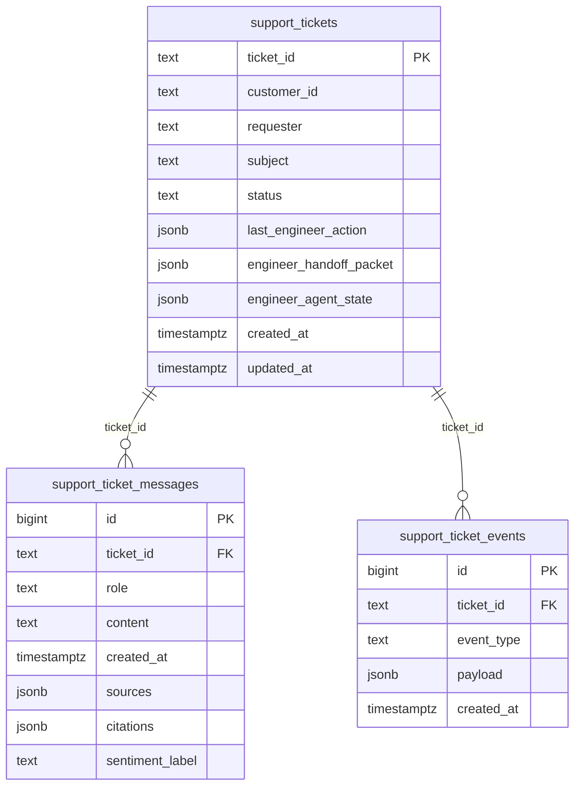

# 工单数据库架构图（PostgreSQL）

```mermaid
erDiagram
    support_tickets ||--o{ support_ticket_messages : "ticket_id"
    support_tickets ||--o{ support_ticket_events : "ticket_id"

    support_tickets {
        text ticket_id PK
        text customer_id
        text requester
        text subject
        text status
        jsonb last_engineer_action
        jsonb engineer_handoff_packet
        jsonb engineer_agent_state
        timestamptz created_at
        timestamptz updated_at
    }

    support_ticket_messages {
        bigint id PK
        text ticket_id FK
        text role
        text content
        timestamptz created_at
        jsonb sources
        jsonb citations
        text sentiment_label
    }

    support_ticket_events {
        bigint id PK
        text ticket_id FK
        text event_type
        jsonb payload
        timestamptz created_at
    }
```

## 索引
- `support_tickets(status, updated_at DESC)`
- `support_ticket_messages(ticket_id, created_at ASC, id ASC)`
- `support_ticket_events(ticket_id, created_at DESC)`

## Dashboard 情绪统计
- 运营看板从 `support_ticket_messages.sentiment_label` 推导实时情绪信号。
- 每张工单只取最新一条客户消息的 `sentiment_label` 参与 `sentiment_breakdown` 和 `sentiment_alert_count`。

## 语义分层
- `support_tickets`：工单当前状态快照（查询列表/详情主入口）
- `support_tickets.engineer_handoff_packet`：client AI 升级给 engineer AI 的结构化 ticket-level handoff，上层 dashboard 后续可以直接消费
- `support_tickets.engineer_agent_state`：engineer AI 最近一次持久工作状态快照（问题理解、目标、缺失信息、下一步请求）
- `support_ticket_messages`：会话消息明细（客户、AI、工程师）
- `support_ticket_events`：事件审计流（创建、状态变更、告警等）

## Investigation Agent 数据流
- 自动进入 `investigating` 时，route decision、candidate answer、sources、citations、evidence summary 会写入 `engineer_handoff_packet`。
- engineer AI 每轮会基于公开对话、handoff packet、internal thread 和 engineer 最新回复，刷新 `engineer_agent_state`。
- 事件总线只传播轻量 agent 摘要字段：
  - `agent_phase`
  - `agent_ready_to_reply`
  - `agent_goal`
  - `agent_next_request_for_engineer`
  - `agent_updated_at`
- 完整 handoff packet 和完整 agent state 保留在 ticket 顶层，不直接塞进 realtime/event payload。
