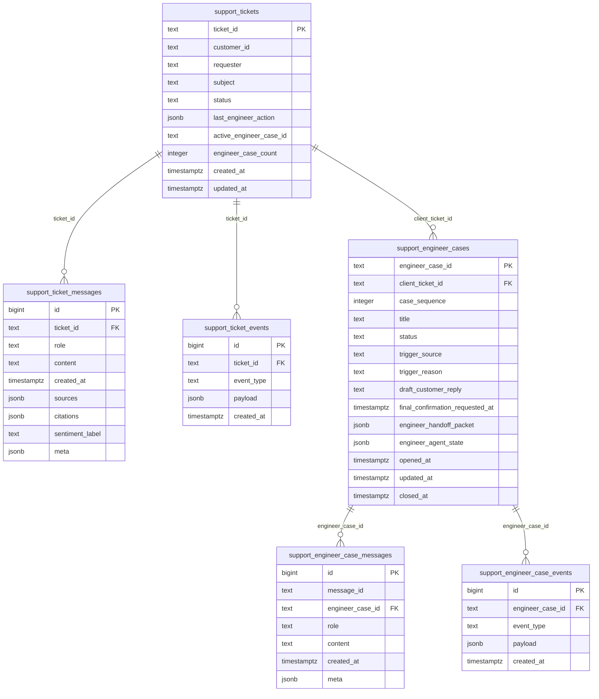

# 工单数据库架构图（client ticket / engineer case）

```mermaid
erDiagram
    support_tickets ||--o{ support_ticket_messages : "ticket_id"
    support_tickets ||--o{ support_ticket_events : "ticket_id"
    support_tickets ||--o{ support_engineer_cases : "client_ticket_id"
    support_engineer_cases ||--o{ support_engineer_case_messages : "engineer_case_id"
    support_engineer_cases ||--o{ support_engineer_case_events : "engineer_case_id"

    support_tickets {
        text ticket_id PK
        text customer_id
        text requester
        text subject
        text status
        jsonb last_engineer_action
        text active_engineer_case_id
        integer engineer_case_count
        timestamptz created_at
        timestamptz updated_at
    }

    support_ticket_messages {
        bigint id PK
        text ticket_id FK
        text role
        text content
        timestamptz created_at
        jsonb sources
        jsonb citations
        text sentiment_label
        jsonb meta
    }

    support_ticket_events {
        bigint id PK
        text ticket_id FK
        text event_type
        jsonb payload
        timestamptz created_at
    }

    support_engineer_cases {
        text engineer_case_id PK
        text client_ticket_id FK
        integer case_sequence
        text title
        text status
        text trigger_source
        text trigger_reason
        text draft_customer_reply
        timestamptz final_confirmation_requested_at
        jsonb engineer_handoff_packet
        jsonb engineer_agent_state
        timestamptz opened_at
        timestamptz updated_at
        timestamptz closed_at
    }

    support_engineer_case_messages {
        bigint id PK
        text message_id
        text engineer_case_id FK
        text role
        text content
        timestamptz created_at
        jsonb meta
    }

    support_engineer_case_events {
        bigint id PK
        text engineer_case_id FK
        text event_type
        jsonb payload
        timestamptz created_at
    }
```

## 索引
- `support_tickets(status, updated_at DESC)`
- `support_ticket_messages(ticket_id, created_at ASC, id ASC)`
- `support_ticket_events(ticket_id, created_at DESC)`
- `support_engineer_cases(client_ticket_id, updated_at DESC)`
- `support_engineer_cases(status, updated_at DESC)`
- `support_engineer_case_messages(engineer_case_id, created_at ASC, id ASC)`
- `support_engineer_case_events(engineer_case_id, created_at DESC)`

## 语义分层
- `support_tickets`
  - 客户侧主工单快照
  - client UI 的唯一 canonical ticket identity
- `support_engineer_cases`
  - 工程师侧一等 case 快照
  - engineer UI 的唯一 canonical work item identity
- `support_ticket_messages`
  - parent client ticket 的公开对话
  - route/runtime/client-intake 等扩展消息元数据持久化在 `meta`
- `support_engineer_case_messages`
  - engineer AI / engineer 的内部调查线程
- `support_ticket_events`
  - client ticket 级别事件流
- `support_engineer_case_events`
  - engineer case 级别事件流

## Agent 数据归属
- `engineer_handoff_packet`
  - 现在归属 `support_engineer_cases`
  - 用于保存 client AI 升级给 engineer AI 的结构化交接信息
- `engineer_agent_state`
  - 现在归属 `support_engineer_cases`
  - 用于保存 engineer AI 最近一次持久工作状态
- 这两个字段不再挂在 `support_tickets` 顶层。

## 标识规则
- client ticket ID：`TK-040`
- linked engineer case ID：`TK-040-1`
- 同一张 client ticket 再次进入 engineer handling：
  - 产生 `TK-040-2`
- engineer case title：
  - 由 unresolved issue 快照生成
  - 不默认复用 parent client subject
  - 当前版本不自动重命名

## 数据流
- client AI 无法安全回答时：
  - 更新 parent client ticket 状态
  - 创建或刷新 active engineer case
  - 将 route summary / rag result 写入 engineer case handoff
  - 将 engineer AI brief / goal / missing info 写入 engineer case state
- 工程师在 case 中回复时：
  - 只写 engineer case messages
  - parent client ticket 公开消息不变
- 工程师 approve 后：
  - engineer case 关闭
  - customer-facing final assistant reply 回写 parent client ticket
  - client ticket 回到 `communicating`

## Dashboard / Realtime 约束
- 当事件与 engineer case 相关时，payload 应同时携带：
  - `client_ticket_id`
  - `engineer_case_id`
- engineer-facing realtime payload 只带轻量摘要：
  - `agent_phase`
  - `agent_ready_to_reply`
  - `agent_goal`
  - `agent_next_request_for_engineer`
  - `agent_updated_at`
- 完整 `handoff_packet` 和完整 `engineer_agent_state` 只保存在 engineer case 存储中，供后续 dashboard 读取。
